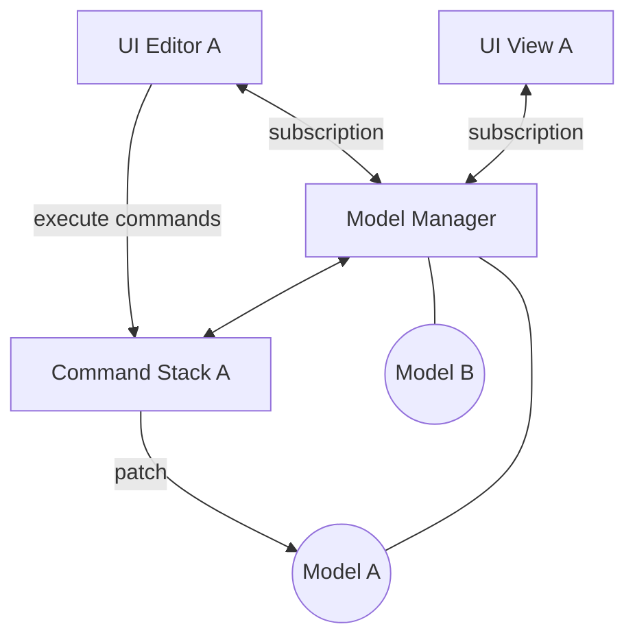

# Model Management User Guide

This document provides scenario-oriented guidance for adopters of the Model Management framework for data management in Theia-based applications.

## Contents

-   [Overview](#overview)
-   [The Model Manager](#the-model-manager)
    -   [Editing with Commands](#editing-with-commands)
        -   [Command Results](#command-results)
        -   [Edge Cases](#edge-cases)
        -   [Editing Foreign Models](#editing-foreign-models)
        -   [Observing Foreign Models](#observing-foreign-models)
            -   [Model Manager Subscriptions](#model-manager-subscriptions)
            -   [Model Accessor Bus](#model-accessor-bus)
                -   [Getting the Model Accessor Bus in the Theia Frontend](#getting-the-model-accessor-bus-in-the-theia-frontend)
        -   [Advanced Command Scenarios](#advanced-command-scenarios)
            -   [Executing a Command on Multiple Stacks](#executing-a-command-on-multiple-stacks)
            -   [Command Stack Subscriptions](#command-stack-subscriptions)
-   [Model Validation Service](#model-validation-service)
    -   [Model Validation Subscriptions](#model-validation-subscriptions)
-   [Trigger Engine](#trigger-engine)
    -   [Interactions with Commands](#interactions-with-commands)
-   [The Model Hub](#the-model-hub)
    -   [Implementing an Extension's Model](#implementing-an-extensions-model)
        -   [Model Service Contributions](#model-service-contributions)
        -   [Model Persistence Contribution](#model-persistence-contribution)
        -   [Model Validation Contribution](#model-validation-contribution)
        -   [Model Triggers Contribution](#model-triggers-contribution)
        -   [Public Model Service API](#public-model-service-api)
    -   [Accessing the Model Hub](#accessing-the-model-hub)
        -   [Model Hub Context](#model-hub-context)
        -   [Getting the Model Hub in the Theia Backend](#getting-the-model-hub-in-the-theia-backend)
        -   [Getting the Model Hub in the Theia Frontend](#getting-the-model-hub-in-the-theia-frontend)
        -   [Disposing the Model Hub](#disposing-the-model-hub)
    -   [Private Model Service APIs](#private-model-service-apis)
        -   [Address Book Private API](#address-book-private-api)
    -   [Model Hub Subscriptions](#model-hub-subscriptions)
    -   [Model Hub Model Validation](#model-hub-model-validation)
    -   [Model Dirty State](#model-dirty-state)
    -   [Undo and Redo](#undo-and-redo)

## Overview

The primary motivation of the _Model Management Framework_ is to provide a structured mechanism for editing JSON documents, called _models_, in any number of UI views (editors) with automatic undo and redo.



Views and editors in the UI use their own separate command stacks to edit models using undoable commands.

## The Model Manager

[back to top ↩︎](#contents)

<details>
<summary>Source Code</summary>

The example code in this section may be found in the repository in the [`@example/model-management` package's `model-manager.ts` script](../../examples/guide/model-management/src/model-manager.ts) and may be run by executing `yarn example:modelmanager` in a terminal.

</details>

An NPM package may maintain its user data in one or more JSON documents, which for the purposes of this guide (and the APIs) are called _Models_.

For the purposes of this guide, the model will be a simple address book and the keys of model instances will be strings.

```typescript
export type AddressBook = {
    entries: {
        lastName: string;
        firstName: string;
        addresses: {
            kind: 'home' | 'work' | 'other';
            numberAndStreet: string;
            unit?: string;
            city: string;
            province?: string;
            state?: string;
            otherAdministrativeSubdivision?: string;
            country: string;
        }[];
    }[];
};

export type AddressEntry = AddressBook['entries'][number];
export type Address = AddressEntry['addresses'][number];
export type AddressKind = Address['kind'];
export type JSONPointer = string;

export const AddressBookModelID = '@example/address-book';

export function isAddressBook(input: unknown): input is AddressBook {
    // This should check the shape of the content, perhaps using something like Zod.
    return (
        !!input &&
        typeof input === 'object' &&
        'entries' in input &&
        Array.isArray(input.entries)
    );
}
```

The primary instrument for the management of _models_ is the `ModelManager`.
Foremost, it allows us to associate instances of our models with keys for subsequent retrieval.

Ordinarily, you would not create a `ModelManager` like this yourself, but instead the `ModelHub` would create it (assuming you are using the _Model Services_ layer) and it would inject the `ModelManager` into your `ModelServiceContribution`.
See the [Model Hub section](#the-model-hub), below, for details.

```typescript
import { AddressBook, isAddressBook } from './model';
import {
    ModelManager,
    createModelManager,
} from '@eclipse-emfcloud/model-manager';

const modelManager: ModelManager<string> = createModelManager();
const contacts: AddressBook = {
    entries: [],
};

modelManager.setModel('example:contacts.addressbook', contacts);

const addressBook: AddressBook = modelManager.getModel(
    'example:contacts.addressbook'
);
console.log('Contacts address book:', addressBook);

// Contacts address book: {
//   entries: []
// }
```

The recommended best practice for model IDs is to use URI strings where

-   the _scheme_ is something application-specific that you define.
    For illustrative purposes here, we use an `example` scheme
-   the rest can be an opaque URI of whatever parseable structure best suits your application, or an hierarchical URI _path_.
    In the context of a Theia-based application, for example, it may be expedient to use a path relative to the workspace root or relative to some _project_ folder in the workspace.
    In our example we are using a path-like structure with a `.addressbook` suffix that makes the model ID recognizable as an _Address Book_ model

> [!CAUTION]
> Model management comes with built-in support for JSON Patch.
> As JSON Patch is only defined for JSON documents, it does not support `undefined` properties or array values.
> The built-in modification commands already come with safeguards, see section [Edge Cases](#edge-cases), however they assume a JSON compatible model is set in the `ModelManager` to begin with.
>
> Therefore we recommend to make sure that only "clean" models are initially handed over.
> If you are unsure, you can apply the exported `jsonTransform` helper to your model before calling `ModelManager.set`.

### Editing with Commands

[back to top ↩︎](#contents)

<details>
<summary>Source Code</summary>

The example code in this section may be found in the repository in the [`@example/model-management` package's `model-manager.ts` script](../../examples/guide/model-management/src/model-manager.ts) and may be run by executing `yarn example:modelmanager` in a terminal.

</details>

So far, our `contacts` address book is empty: it has no entries.
The way to add entries, or indeed to make any other kind of change to the address book, is to execute _Commands_ on a _Command Stack_.
A `ModelManager` provides any number of `CommandStack`s with unique string identifiers.
Different command stacks may be used to edit different models or different command stacks may be used to edit different aspects of the same model.
Applications have the flexibility to determine how to isolate changes in their editors from one another using separate command stacks.

To effect a change to a model, we execute a `Command` on some stack.
All `Command`s executed on the same stack form a linear history of edits that can be undone and redone.

> [!NOTE]
> Under the hood, all of the `CommandStack`s of a `ModelManager` are implemented in a single command history partitioned by stack ID.
> This internal implementation provides more flexibility by the ability to execute commands on multiple virtual stacks to capture dependencies between changes in different editing contexts.
> This is a subject for a more advanced guide.

Let us add an entry to the `contacts` address book.

```typescript
import { AddressEntry } from './model';
import {
    CommandStack,
    createModelUpdaterCommand,
} from '@eclipse-emfcloud/model-manager';

const entryToAdd: AddressEntry = {
    lastName: 'Brown',
    firstName: 'Alice',
    addresses: [
        {
            kind: 'home',
            numberAndStreet: '123 Front Street',
            city: 'Exampleville',
            province: 'Ontario',
            country: 'Canada',
        },
    ],
};
const addEntry = createModelUpdaterCommand(
    'Add Entry',
    'example:contacts.addressbook',
    (model: AddressBook) => model.entries.push(entryToAdd)
);

const stack: CommandStack<string> = modelManager.getCommandStack('main');
await stack.execute(addEntry);
```

And then let us see the what effect this command had.

```typescript
console.log('Contacts address book:', addressBook);

// Contacts address book: {
//   entries: []
// }
```

_Apparently, no effect at all?_
No, actually in executing the `Command` to edit the model, the `CommandStack` created _a new edition_ of the model object.
Our `addressBook` variable is still referencing the previous edition.

To access the updated model with our change, we need to retrieve it again from the `ModelManager`:

```typescript
const updatedAB = modelManager.getModel<AddressBook>(
    'example:contacts.addressbook'
);
console.log('Updated contacts address book:', updatedAB);

// Updated contacts address book: {
//   entries: [
//     {
//       lastName: 'Brown',
//       firstName: 'Alice',
//       addresses: [
//         {
//           kind: 'home',
//           numberAndStreet: '123 Front Street',
//           city: 'Exampleville',
//           province: 'Ontario',
//           country: 'Canada'
//         }
//       ]
//     }
//   ]
// }
```

Now we see the new entry that we added to the address book.

A benefit of using JSON Patch for our editing commands is that they automatically provide undo/redo capability.
Let's undo the edit, remembering to retrieve the new edition of the model from the `ModelManager` afterwards to see the change:

```typescript
console.log('Can undo?', await stack.canUndo());
await stack.undo();
const undoneAB = modelManager.getModel<AddressBook>(
    'example:contacts.addressbook'
);
console.log('Unedited address book:', undoneAB);

// Can undo? true
// Unedited address book: {
//   entries: []
// }
```

It is always best to check first whether the command stack is in a state where it has some command available to undo and that command reports that it can correctly undo itself.

Similarly, to redo the command that we just undid:

```typescript
console.log('Can undo?', await stack.canUndo());
console.log('Can redo?', await stack.canRedo());
await stack.redo();
const redoneAB = modelManager.getModel<AddressBook>(
    'example:contacts.addressbook'
);
console.log('Re-edited address book:', redoneAB);

// Can undo? false
// Can redo? true
// Re-edited address book: {
//   entries: [
//     {
//       lastName: 'Brown',
//       firstName: 'Alice',
//       addresses: [
//         {
//           kind: 'home',
//           numberAndStreet: '123 Front Street',
//           city: 'Exampleville',
//           province: 'Ontario',
//           country: 'Canada'
//         }
//       ]
//     }
//   ]
// }
```

Let us review what we saw, above:

1. Because our models are JSON documents, a convenient mechanism for describing the edits that we want to execute via _Commands_ is the [_JSON Patch_][jsonpatch] language.
   The _Model Management_ framework provides a `PatchCommand` that uses a standard JSON Patch description of the changes we want to make and applies them to the model using the [fast-json-patch][fjp] library.
   Two convenient features of JSON patches are that they provide undo/redo without any effort required of the developer and `test` assertion operations can be included in a patch to ensure that only safe changes are applied.
   The patches computed by the `PatchCommand` for undo/redo use `test` operations to assert that they are applicable to the current model state at the time of undo or redo.
2. Command-based editing in the `CommandStack` implements a copy-on-write strategy.
   The command is applied to a _working copy_ of the model that it is to edit and, only when all changes are completed successfully, that working copy is committed to the `ModelManager`.
   This is why (a) the `Command` is configured with the ID of the model that it edits, not the model object itself and (b) the image of the model originally retrieved from the `ModelManager` (the `addressBook` variable) was still in the state before the edit was performed.
3. Undo/redo likewise operate in this copy-on-write fashion.
4. The `canUndo()` method queries whether the `CommandStack` has not yet reached the beginning of the undo history and the next command to be undone can be undone.
5. The `canRedo()` method queries whether the `CommandStack` has not yet reached the end of the redo history and the next command to be redone can be redone.
   Whenever another `Command` is executed, it is placed atop the undo history and the redo history (if any) is cleared.

Additionally, not illustrated above is that the return result from successful execution of a command (or undo/redo) is a `Map` providing, for each `Command` — a `CompoundCommand` may encompass many commands — a JSON patch describing the changes that it made to the model.
Because the implementation of command may depend on asynchronous computations, their `execute()`, `undo()`, and `redo()` methods are optionally `async` and therefore the corresponding methods of the `CommandStack` return `Promise`s.
Accordingly, for most uses, the settled state of this promise will be all that the application needs.
We shall [see below](#model-manager-subscriptions) a more general mechanism for observing changes to models that supersedes most other uses of these command results.

[jsonpatch]: https://www.rfc-editor.org/rfc/rfc6902
[fjp]: https://www.npmjs.com/package/fast-json-patch

#### Command Results

[back to top ↩︎](#contents)

Often it happens that a command you execute on some model is opaque to you.
You are not intended to know the details of the structure of the model or the specific changes that the command applies to it.
However, you may need to be informed in abstract terms of what the command did in order to proceed logically with some further computation.
This is the purpose of _commands with results._

Let us reimagine the scenario of addition of an entry to the Address Book, only this time the command that adds entries maintains them in alphabetical order from A to Z, by last name and then by first name.
In this case, we may need to know upon successful completion of the command, at what index was the entry added?
This is a contrived example in which it would be just as easy to determine the answer by _post facto_ inspection of the model, but it is not always so.

```typescript
import { AddressEntry } from './model';
import {
    CommandStack,
    append,
    createModelUpdaterCommandWithResult,
} from '@eclipse-emfcloud/model-manager';

const alice: AddressEntry = {
    lastName: 'Brown',
    firstName: 'Alice',
    addresses: [
        {
            kind: 'home',
            numberAndStreet: '123 Front Street',
            city: 'Exampleville',
            province: 'Ontario',
            country: 'Canada',
        },
    ],
};

const addAddressEntry = (entryToAdd: AddressEntry) =>
    createModelUpdaterCommandWithResult(
        'Add Entry',
        'example:contacts.addressbook',
        (model: AddressBook) => {
            const index = sortedIndexBy(
                model.entries,
                entryToAdd,
                (item) =>
                    item.lastName.localeCompare(entryToAdd.lastName) ||
                    item.firstName.localeCompare(entryToAdd.firstName)
            );
            model.entries.splice(index, 0, entryToAdd);
            return { index };
        }
    );

const stack: CommandStack<string> = modelManager.getCommandStack('main');

const addAlice = addAddressEntry(alice);
await stack.execute(addAlice);
```

And then let us see what the result of this command is:

```typescript
console.log('Inserted entry at index', addAlice.result!.index);

// Inserted entry at index 0
```

Well, yes of course, because the address book was initially empty, the index at which this entry was inserted could only be zero.

Until the command is executed, its `result` property will be `undefined`.
After successful execution, it will have whatever value was returned by the model updater function.

These commands can be composed into larger units just like any others:

```typescript
const addBobbi = addAddressEntry({
    lastName: 'Ayala',
    firstName: 'Bobbi',
    addresses: [],
});
const addCathy = addAddressEntry({
    lastName: 'Ayala',
    firstName: 'Cathy',
    addresses: [],
});
await stack.execute(append(addBobbi, addCathy));

console.log('Bobbi inserted at index', addBobbi.result!.index);
console.log('Cathy inserted at index', addCathy.result!.index);

// Bobby inserted at index 0
// Cathy inserted at index 1
```

As a special case, commands may be composed in a chain where the results of earlier commands in the chain flow down as inputs to later commands.

### Edge Cases

[back to top ↩︎](#contents)

As JSON patch is only defined for JSON documents, it lacks specification pertaining to `undefined` values.
While [fast-json-patch has some capabilities to work around `undefined` values][fast-json-patch-undefined], sadly they are not sufficient out of the box.
Its modification operations are handled according to the workaround, however the generated "test" operations will fail as they can't test for `undefined` values.
As a consequence, working with fast-json-patch directly might lead to non-applicable patches in case such `undefined` values are part of the used models.

To avoid these problems, the user might only want to operate on and modify their models in a JSON compatible way.
Properties should not be set to `undefined` but properly deleted and arrays should not contain `undefined` values.

```typescript
model.name = undefined; // improper deletion leading to errors later on
delete model.name; // that's the way!

model.children.push(undefined); // not an allowed value in arrays leading to errors later on
model.children.push(null); // that's the way!
```

This issue is not only model management related.
Whenever a Javascript object is stringified, for example for persistence, the same operations are executed.
`JSON.parse(JSON.stringify(model))` will `delete` all `undefined` properties and convert all `undefined` array values to `null`.

The good news is that the `PatchCommand` used within model management is already able to handle `undefined` values without throwing errors.
Therefore the following code is allowed:

```typescript
createModelUpdaterCommand(
    'Undefined modifications',
    'modelid',
    (model: MyModel) => {
        model.name = undefined; // will not lead to errors as we will generate a "remove" operation
        model.children.push(undefined); // undefined will be converted to "null"
    }
);
```

> [!CAUTION]
> When only using PatchCommands you will not need to worry about `undefined` values as they are automatically taken care of as described, i.e. a `PatchCommand` will always modify models in a JSON compatible manner.
>
> However the PatchCommand itself assumes that the model stored within the `ModelManager` is already JSON compatible.
> Should this **not** be the case, for example by initially setting an invalid model in `ModelManager` or by using a different command implementation which does not have the same guarantees, then the `PatchCommand` will likely break, either on execution or undo/redo.

In summary: When using model management you should avoid storing `undefined` values in arrays as you might not expect the transformed `null` values.
Undefined properties are fine and will be transparently handled.

> [!NOTE]
> In case you want to apply the same transformation in some other context, our internally used helper `jsonTransform` is exported.
> It can be applied on any Javascript object.
> It will modify the object in place, if necessary, to make it JSON compatible.
>
> ```typescript
> const model = { a: undefined, b: 'foo', c: ['bar', undefined, 'foobar'] };
> console.log(model);
> //
> // {
> //   a: undefined,
> //   b: 'foo',
> //   c: ['bar', undefined, 'foobar']
> // }
>
> jsonTransform(model);
> console.log(model);
>
> //
> // {
> //   b: 'foo',
> //   c: ['bar', null, 'foobar']
> // }
> ```

[fast-json-patch-undefined]: https://github.com/Starcounter-Jack/JSON-Patch#undefineds-js-to-json-projection

### Editing Foreign Models

[back to top ↩︎](#contents)

<details>
<summary>Source Code</summary>

The example code in this section may be found in the repository in the [`@example/model-management` package's `foreign-model-update.ts` script](../../examples/guide/model-management/src/foreign-model-update.ts) and may be run by executing `yarn example:foreignmodelupdate` in a terminal.

</details>

In many applications, models do not exist in isolation but have some kind of relationship — explicit or not — with other models.
For example, imagine a package tracking application that maintains a JSON document recording the status and history of pending package shipments and integrates with the Address Book for addressing packages.
Such an application may wish to refer to the Address Book model to look up addresses for recipients and may wish to _add_ a shipping address to the Address Book when the latter doesn't yet have that address for the recipient.

To support our analysis of dependencies between the Address Book and Package Tracking models, we add a helper function to the Address Book model that searches an address book for a particular entry by name and, if found, returns that entry and a JSON Pointer locating it within the model object:

```typescript
export function getAddressBookEntryWithPointer(
    addressBook: AddressBook,
    lastName: string,
    firstName: string
): [AddressEntry, JSONPointer] | undefined {
    const index = addressBook.entries.findIndex(
        (entry) => entry.lastName === lastName && entry.firstName === firstName
    );
    if (index >= 0) {
        return [addressBook.entries[index], `/entries/${index}`];
    }
    return undefined;
}
```

Then, the NPM package maintaining the Package Tracking model can ensure that the contacts address book has the addresses used for shipping packages.
We start with the basic command to add a shipment to the Package Tracking model:

```typescript
import {
    Address,
    AddressBook,
    AddressEntry,
    getAddressBookEntryWithPointer,
} from './model';
import { PackageTracking, getNewShipment } from '@example/package-tracking';
import {
    Command,
    CommandStack,
    ModelManager,
    append,
    isCompoundCommand,
    createModelUpdaterCommand,
} from '@eclipse-emfcloud/model-manager';
import { getValueByPointer } from 'fast-json-patch';
import { eq as deepEqual } from 'lodash';

const packages = modelManager.getModel<PackageTracking>(
    'example:packages.shipping'
);
const shipment = getNewShipment(packages);

let addShipment: Command<string> = createModelUpdaterCommand(
    'Add Shipment',
    'example:packages.shipping',
    (model: PackageTracking) => model.shipments.push(shipment)
);
```

Then, we see whether the Address Book model already has this address for the recipient:

```typescript
const contacts = modelManager.getModel<AddressBook>(
    'example:contacts.addressbook'
);
const [abEntry, abPointer] = getAddressBookEntryWithPointer(
    contacts,
    shipment.recipient.lastName,
    shipment.recipient.firstName
);
const existingAddress = abEntry.addresses.find((addr) => {
    const { kind, ...withoutKind } = addr;
    return deepEqual(withoutKind, shipment.shipTo);
});
```

If we find this address, we've nothing else to edit.
Otherwise, we create another command to add the address to the Address Book model and _append_ it to the first command, resulting in a `CompoundCommand` that aggregates both commands together.
This `CompoundCommand` ensures that our two commands are executed in a single step on both models and are a single unit on the undo history for undo/redo together.

```typescript
if (!existingAddress) {
    const shippingAddres: Address = { ...shipment.shipTo, kind: 'work' };
    const addAddress = createModelUpdaterCommand(
        'Add Shipping Address',
        'example:contacts.addressbook',
        (model: AddressBook) => {
            const entry = getValueByPointer(model, abPointer) as AddressEntry;
            entry.addresses.push(shippingAddress);
        }
    );
    addShipment = append(addShipment, addAddress);
}
```

Because we set up our address book not to have this address, we find that we did create the second command and compose it with the first.
And we can see that the result of executing this compound command provides the distinct JSON Patch deltas for each of the two models:

```typescript
const stack: CommandStack<string> = modelManager.getCommandStack('main');
const delta = await stack.execute(addShipment);

if (delta) {
    for (const [cmd, patch] of delta) {
        if (!isCompoundCommand(cmd)) {
            console.log('Model update:', cmd.modelId, patch);
        }
    }
}

// Model update: example:packages.shipping [
//   {
//     op: 'add',
//     path: '/shipments/0',
//     value: {
//       recipient: { lastName: 'Brown', firstName: 'Alice' },
//       shipTo: {
//         numberAndStreet: '123 Front Street',
//         city: 'Exampleville',
//         province: 'Ontario',
//         country: 'Canada'
//       }
//     }
//   }
// ]
// Model update: example:contacts.addressbook [
//   {
//     op: 'add',
//     path: '/entries/0/addresses/0',
//     value: {
//       numberAndStreet: '123 Front Street',
//       city: 'Exampleville',
//       province: 'Ontario',
//       country: 'Canada',
//       kind: 'work'
//     }
//   }
// ]
```

In review, this code sample illustrates several noteworthy points:

1. We declare the `addShipment` variable as type `Command<string>`.
   `Command` is an union of the two kinds of command that can be executed on the `CommandStack`:
    - `SimpleCommand`, which is the basic building block of complex and of which the `PatchCommand` is an example, and
    - `CompoundCommand`, which aggregates any number of `Command`s.
2. When we find that the address book entry for the recipient doesn't yet have the ship-to address of our package, we create a command to add it (arbitrarily as a work address).
   If in the future the user undoes the adding of the shipment to the `packages` model, we also want to undo the addition of that package's ship-to address to the `contacts` model because we only did that to support the new package shipment.
   This is accomplished by _composing_ the two commands into a `CompoundCommand` to execute as a single undoable unit using the `append()` function, instead of executing two separate commands on the stack.
3. In printing out the model deltas resulting from the execution of our compound command, we filter out deltas for commands that are compounds.
   The only alternative to a `CompoundCommand` is a `SimpleCommand` that has the `modelId` to which it is (was) applied.
   In general, only `SimpleCommand`s will have deltas in these command results because a single JSON Patch can only apply to one JSON document and it cannot, in itself, identify that document.

### Observing Foreign Models

[back to top ↩︎](#contents)

In addition to make dependent changes in other models when we execute commands to change our own, oftentimes the inverse is true: we need to makes changes to _our_ models when we detect changes in some other related models.

#### Model Manager Subscriptions

[back to top ↩︎](#contents)

<details>
<summary>Source Code</summary>

The example code in this section may be found in the repository in the [`@example/model-management` package's `foreign-model-sub.ts` script](../../examples/guide/model-management/src/foreign-model-sub.ts) and may be run by executing `yarn example:foreignmodelsub` in a terminal.

</details>

To observe changes in another model (or even our own) we can use a facility of the _Model Manager_ called _subscriptions_.

For example, we can invert the logic of the package tracking model [illustrated above](#editing-foreign-models) by listening for changes to the package tracking model and adding to the address book any addresses that it doesn't have.

Let us start with a helper function to determine whether the Address Book model has the recipient's address in a `Shipment` being added to the Package Tracking model:

```typescript
import { AddressBook, getAddressBookEntryWithPointer } from './model';
import { Shipment } from '@example/package-tracking';
import {
    Command,
    CommandStack,
    ModelManager,
    PatchCommand,
    append,
} from '@eclipse-emfcloud/model-manager';
import { AddOperation, getValueByPointer } from 'fast-json-patch';
import { eq as deepEqual } from 'lodash';

const hasContactAddress = (shipment: Shipment): boolean => {
    const contacts = modelManager.getModel<AddressBook>(
        'example:contacts.addressbook'
    );
    const entry = getAddressBookEntryWithPointer(
        contacts,
        shipment.recipient.lastName,
        shipment.recipient.firstName
    )?.[0];
    return (
        !!entry &&
        entry.addresses.some((addr) => {
            const { kind, ...withoutKind } = addr;
            return deepEqual(withoutKind, shipment.shipTo);
        })
    );
};
```

Then we create a command that would add the recipient address from a `Shipment` in the eventuality that it is, in fact, not yet present in the Address Book model:

```typescript
const addContactAddress = (shipment: Shipment): Command<string> => {
    const address = { kind: 'work', ...shipment.shipTo };
    const [entry, pointer] = getAddressBookEntryWithPointer(
        contacts,
        shipment.recipient.lastName,
        shipment.recipient.firstName
    );
    const patch: Operation[] = [];
    if (entry) {
        return createModelUpdaterCommand(
            'Contact Sync',
            'example:contacts.addressbook',
            (model: AddressBook) => {
                const entryToUpdate = getValueByPointer(
                    model,
                    apointer
                ) as AddressEntry;
                entryToUpdate.addresses.push(shippingAddress);
            }
        );
    } else {
        const entryToAdd: AddressEntry = {
            ...shipment.recipient,
            addresses: [{ ...shipment.shipTo, kind: 'work' }],
        };
        return createModelUpdaterCommand(
            'Contact Sync',
            'example:contacts.addressbook',
            (model: AddressBook) => model.entries.push(entryToAdd)
        );
    }
};
```

Now we are ready to hook up a _subscription_ that will update the Address Book if and as needed when some `Shipment` is added to the Package Tracking model.
In this example, we subscribe to the specific model ID of the Package Tracking model that we want to observe.

```typescript
const packagesSub = modelManager.subscribe('example:packages.shipping');
packagesSub.onModelChanged = async (_modelId, _model, delta) => {
    if (!delta) {
        return;
    }

    const command = delta
        .filter((op) => op.op === 'add')
        .filter((op) => /\/shipments\/\d+/.test(op.path))
        .map((op) => op as AddOperation<Shipment>)
        .filter((op) => !hasContactAddress(op.value))
        .map((op) => addContactAddress(op.value))
        .reduce((prev, curr) => append(prev, curr));
    if (command) {
        const stack = modelManager.getCommandStack('dependency-sync', {
            keepHistory: false,
        });
        if (await stack.canExecute(command)) {
            stack.execute(command);
        }
    }
};
```

When we no longer need a subscription, it can be stopped by _closing_ it.
Alternatively, the call-back functions that are no longer required can be replaced by `undefined`, which is most useful if some call-backs are to be retained but not others.

```typescript
packagesSub.close();
```

In review, we see that a subscription is created by the `subscribe()` method of the `ModelManager`.
Here we subscribe to the model ID of the package tracking model specifically, so we do not need to read the model ID parameter of the `onModelChanged` call-back function that we supply.
A subscription could also target multiple model IDs, or none to observe all models, in which case the `modelId` parameter is used to discriminate the response.
Also, because in this the content of the model `delta` JSON patch is sufficient, we do not need to read the model parameter, either, which provides the "after" edition of the model, its current state in the `ModelManager`.

For each patch operation that adds a new shipment, we checked whether we had that contact address already and if we didn't, created a command to add it.
All of these commands are aggregated by the reducer function into a composite (or nothing if there were no commands created).

If the reduction produced a command and it can be executed, then it is executed in a very particular fashion:

-   because we are reacting to changes already committed to another model on some unknown command stack, we don't have a viable editing context in which to apply our change to the `'example:contacts.addressbook'` model, so we use a special command stack for this _dependency synchronization_ scenario that isn't connected to any UI for undo/redo.
-   since the command that we execute will not be presented to the user for undo/redo and will never be undone, we configure this special command stack to not keep any history

> [!NOTE]
> Because _model synchronization_ commands executed from subscriptions in this scenario are not on any undo history, our subscriptions may need to specially account for undo/redo in the foreign model.
> Subscriptions will always be notified of changes that are result from undo/redo, so this should not present any issues.
>
> In our address synchronization example, when the addition of a shipment to the package tracking model is undone, the subscription will see a patch with a `remove` operation that describes the removal of the shipment object.
> At this point we could find the corresponding address in the `'example:contacts.addressbook'` model and remove it, but because we cannot tell by looking at it that it was added originally by this synchronization mechanism, we only react to `add` operations.
> For this example that is OK because (a) there is value in keeping the contact addresses discovered this way and (b) if the package-tracking change is subsequently redone, then the subscription will get another `add` operation as before but this time will find the address already present in the `'example:contacts.addressbook'` model and so will do nothing further.
>
> Other applications may find that in their synchronization logic they can perform the inverse changes in their models when notified of changes from undo in their dependencies.

#### Model Accessor Bus

[back to top ↩︎](#contents)

<details>
<summary>Source Code</summary>

The example code in this section may be found in the repository in the [`@example/model-management` package's `accessor-bus.ts` script](../../examples/guide/model-management/src/accessor-bus.ts) and may be run by executing `yarn example:accessorbus` in a terminal.

</details>

The Model Accessor Bus offers a synchronization layer with readonly access for model services.
Via the bus, model services can indirectly access data that other model services provide, or can subscribe to be notified when that data changes.

A crucial aspect of the bus is its ability to abstract away model internals. This means that consumers of the bus don't need to be aware of the underlying complexities or structural changes in the model. This abstraction facilitates easier updates and modifications to models without disrupting the other services that depend on them.

To make data accessible to consumers via the model accessor bus, a model service `Provider` needs to be registered.
The provider can define one or multiple accessors, which are the functions providing the actual data to the consumers.
Additionally, the bus offers a convenient subscriptions mechanism. Consumers can subscribe to be notified when the data of a specific accessor changes or when any notification is available from the Provider.

> [!NOTE]
> Since the bus only offers readonly access to data, model modifications should be handled differently, for example via the external [model's public API](#public-model-service-api).

For example, imagine a system where various shipping contractors are managed.
Each contractor has a list of packages that it handles and each package is tracked.
The tracking state of the package is saved in a property called status.

Let's assume the package tracking model [illustrated above](#editing-foreign-models) is interested in the state of the packages, but only wants to track when they have been delivered.

The NPM package delivering the shipping contractors model can register a model accessor `Provider`, to allow other models (e.g. the package tracking model) to retrieve specific data.
The provider can offer multiple accessors, but in our example it registers one with the identifier `delivered`.
When called, the accessor evaluates the status property of the contractor's model and returns a `true` if it indicates that the package was delivered.

```typescript
import { DefaultProvider } from '@eclipse-emfcloud/model-accessor-bus';
import { ModelManager } from '@eclipse-emfcloud/model-manager';
import { Operation } from 'fast-json-patch';
import { isEqual } from 'lodash';
import { Shipment } from '@example/package-tracking';
import { ShippingContractors } from '@example/shipping-contractors';

export class ShippingModelProvider extends DefaultProvider {
    modelId: string;
    modelManager: ModelManager<string>;
    constructor(modelId: string, modelManager: ModelManager<string>) {
        super('shipping');
        this.modelId = modelId;
        this.modelManager = modelManager;
        this.isPackageDelivered = this.isPackageDelivered.bind(this);

        this.accessors.set('delivered', this.isPackageDelivered);
    }

    private isPackageDelivered(shipment: Shipment) {
        const model = this.modelManager.getModel<ShippingContractors>(
            this.modelId
        );
        const packageInfo = model?.contractors
            .find((contractor) => contractor.name === shipment.contractor)
            ?.packages.find(
                (pack) =>
                    isEqual(pack.shipment.recipient, shipment.recipient) &&
                    isEqual(pack.shipment.shipTo, shipment.shipTo)
            );
        return packageInfo?.status === 'DELIVERED';
    }
}
```

When the package tracking model wants to consume data from this provider, all it has to do is use the `get` method of the model accessor bus.
The first parameter, the `accessorId`, uses the provider's identifier as a prefix, followed by the key of the accessor it wants to use.
Accessors can have parameters as well, as seen in our example: the shipment is provided to the `delivered` accessor, so it can give us the delivered status of this particular package in the shipping contractors model.

```typescript
const delivered = await accessorBus.get('shipping.delivered', shipment);
```

To be notified when data in a model service changes, other services can subscribe to changes on the accessor bus.
For our example, let's say that we don't want to receive the `delivered` status of package only on demand, but the package tracking model needs to automatically update whenever the status of a known package updates in the shipping contractors model.

For this, the `ShippingModelProvider` can notify all interested parties when the data provided by one of its accessors changes.
Concretely, the provider can listen to model changes and whenever the status property changes, send a notification for the `delivered` subscriber.

```typescript
const subscription = modelManager.subscribe(this.modelId);
subscription.onModelChanged = (
    _modelId: string,
    _model: object,
    delta?: Operation[]
) => {
    if (delta?.some((op) => op.path.endsWith('/status'))) {
        this.notify('delivered');
    }
};
```

The package tracking model can listen to these notifications by subscribing to them on the model accessor bus.

```typescript
accessorBus.subscribe('shipping.delivered', () => {
    handleDeliveredAccessorStatusChanged(modelManager, accessorBus);
});
```

Each time the provider will call its `notify` function with the `delivered` id, our callback `handleDeliveredAccessorStatusChanged` will be invoked.
In the callback, the package tracking model can update its `delivered` property with the value supplied by the accessor.

##### Getting the Model Accessor Bus in the Theia Frontend

[back to top ↩︎](#contents)

<details>
<summary>Source Code</summary>

The example code in this section may be found in the repository in the [`@example/model-hub` Theia extension's `frontend-module.ts` module](../../examples/guide/model-hub/src/browser/frontend-module.ts).

</details>

In the Theia frontend, the Model Accessor Bus is also available through the [FrontendModelHub](#the-model-hub). The `FrontendModelAccessorBus` is an RPC projection of a subset of the `ModelAccessorBus` available in the backend.

This subset excludes:

-   `register()` — a frontend model accessor bus cannot add a provider to its backend counterpart.
-   `unregister()` — a frontend model accessor bus cannot remove a provider from its backend counterpart.

However, like its backend counterpart, it is possible to `subscribe` (and `unsubscribe`) to a `Provider` created in the backend.

In this scenario, the notifications are carried through the RPC proxy from backend to frontend.

To access the `FrontendModelAccessorBus`, it is necessary to call the `FrontendModelHub.getModelAccessorBus()` method.

The subscription scenario is identical to the `ModelAccessorBus` subscription scenario.

Now, let's imagine that in our address book, a user wishes to identify some addresses as its own.
In order to do this, an address can have an optional `isSelf` boolean value, and we want to be able to track changes to such value.

A `Provider` is created and registered in the `backend` to notify when an address `isSelf` value is changed in the address book and provide an accessor to retrieve the `isSelf` addresses for a specific user (using its firstName and lastName):

```typescript
class AddressBookMyAddressProvider extends HubAwareProvider {
    modelId: string;
    modelHub: ModelHub<string, object>;
    refAddressBook: AddressBook;
    constructor(modelId: string) {
        super('addressbook');
        this.modelId = modelId;
        this.get = this.get.bind(this);
        this.accessors.set('my-main-address-changed', this.getMyAddresses);
    }

    setModelHub(modelHub: ModelHub<string, object>): void {
        super.setModelHub(modelHub);
        const subscription = modelHub.subscribe(this.modelId);

        // Store an address book to detect the changes
        this.modelHub
            .getModel<AddressBook>(this.modelId)
            .then((model) => (this.refAddressBook = model));

        subscription.onModelChanged = (
            _modelId: string,
            model: object,
            delta?: Operation[]
        ) => {
            // Make sure the model is an Address Book
            if (!isAddressBook(model)) {
                return;
            }

            // React to changes applied to isSelf
            if (
                delta &&
                nonTestOperations(delta).some(
                    (op) => lastSegment(op.path) === 'isSelf'
                )
            ) {
                let isSelfHasChanged = false;

                const operations = nonTestOperations(delta).filter(
                    (op) => lastSegment(op.path) === 'isSelf'
                );

                for (const operation of operations) {
                    // Search for the address and the parent entry.
                    const addressPath = upToLastSegment(operation.path);
                    const address = getValueByPointer(
                        model,
                        addressPath
                    ) as Address;

                    // Look for the parent entry
                    const entryPath = upToLastSegment(addressPath);
                    const entry = getValueByPointer(
                        model,
                        entryPath
                    ) as AddressEntry;

                    // Look for known entry from our reference Address Book
                    const knownEntry = this.refAddressBook.entries.find(
                        (e) =>
                            e.firstName === entry.firstName &&
                            e.lastName === entry.lastName
                    );

                    // if this is a new entry, trigger is bound to the isSelf value
                    if (!knownEntry) {
                        isSelfHasChanged = address.isSelf ?? false;
                        break;
                    }

                    // otherwise, look for index changes.
                    // First, look for the previous isSelf === true index
                    const firstIsSelfIndex = knownEntry.addresses.findIndex(
                        (knownAddress) => knownAddress.isSelf
                    );

                    // Second, look for the new isSelf === true index
                    const newIsSelfIndex = entry.addresses.findIndex(
                        (address) => address.isSelf
                    );

                    // if the previous isSelf index is different from the new one
                    // set the boolean to trigger the change and exit the loop
                    if (firstIsSelfIndex !== newIsSelfIndex) {
                        isSelfHasChanged = true;
                        break;
                    }
                }

                if (isSelfHasChanged) {
                    this.notify('my-main-address-changed');
                }

                // Update the stored address book
                this.refAddressBook = deepClone(model);
            }
        };
    }

    private async getMyAddresses(
        firstName: string,
        lastName: string
    ): Promise<AddressBookMyAddressesProviderResult> {
        const addressBook = await this.modelHub.getModel<AddressBook>(
            this.modelId
        );
        const result: AddressBookMyAddressesProviderResult = {
            getMainAddress: () => result.myAddresses[0],
            myAddresses: [],
        };

        // Search for my-addresses
        addressBook.entries
            .filter(
                (entry) =>
                    entry.firstName === firstName && entry.lastName === lastName
            )
            .forEach((entry) =>
                result.myAddresses.push(
                    ...entry.addresses.filter((address) => address.isSelf)
                )
            );

        return result;
    }
}
```

This `AddressBookMyAddressProvider` is available in the `backend` and also in the `frontend`.

In the frontend, through the `FrontendModelHub`, we retrieve an instance of `FrontendModelAccessorBus` and subscribe to the notifications:

```typescript
  @postConstruct()
  initialize(): void {
    this.api = this.privateApiFactory(this.project.name);
    this.commandStackId = uuid();
    // Initialize Frontend Model Accessor Bus
    this.modelHubProvider(this.project.name)
      .then(async (frontendModelHub) => {
        // Get the FrontendModelAccessorBus
        this.frontendModelAccessorBus = frontendModelHub.getModelAccessorBus();

        // Initialize a reference address book.
        this.currentAddressBook = await frontendModelHub.getModel<AddressBook>(
          this.project.name
        );

        // Subscribe to FrontendModelAccessorBus
        this.subscribe();
      })
      .catch((err) => console.error(err));
  }

  protected subscribe() {
    this.frontendModelAccessorBus.subscribe(
      'addressbook.my-main-address-changed',
      async (accessorId) => {
        // Iterate on each entry to call the Provider
        this.currentAddressBook.entries.forEach(async (entry) => {
          // Use the Provider `get` function to retrieve the list of my-addresses for this entry
          const updatedMyAddresses =
            await this.frontendModelAccessorBus.get<AddressBookMyAddressesProviderResult>(
              accessorId,
              entry.firstName,
              entry.lastName
            );

          if (updatedMyAddresses) {
            //
            // Search for changes between the saved model and the list of addresses
            // Or just update the displayed the data
            //
          }
        });
      }
    );
  }
```

In the above example, the frontend will receive the notifications only when an address `isSelf` value has changed, not for all the changes applied to the `ModelHub` (as would be the case if we were to listen to the `onModelChanged`).

Depending on the scenario, it may be necessary to compare the saved data with the updated ones, for example, to update the view and apply a specific coloring/style to the updated fields.

### Advanced Command Scenarios

[back to top ↩︎](#contents)

<details>
<summary>Source Code</summary>

The example code in this section may be found in the repository in the [`@example/model-management` package's `model-commands-advanced.ts` script](../../examples/guide/model-management/src/model-commands-advanced.ts) and may be run by executing `yarn example:advancedcommands` in a terminal.

</details>

#### Executing a Command on Multiple Stacks

The `CommandStack` API is built atop a more flexible `CoreCommandStack` providing additional capabilities for the less common editing scenarios such as edits with dependencies on other models that otherwise are edited more or less independently each in their own UI editor context.
So, in our example models, whereas the Address Book and Package Tracking models typically are edited each in a separate editor with its own `CommandStack` for undo/redo, some edits will make changes in _both models_ together, introducing a dependency in undo/redo that needs special care.

Consider the example [illustrated above](#editing-foreign-models) in which, when we add a new shipment to the Package Tracking model, we also add the delivery address to the recipient's entry in the Address Book model if that entry does not already have that address.
These two changes are combined into one undoable unit by composing the commands.
Naively, we would execute this command on the Package Tracking editor's command stack because the intent is to add a shipment in that context, but we have introduced a dependency on previous edits in the Address Book model: if there is a command in the Address Book editor's stack that added the entry to which we are adding an address, then we could have a problem if we try to undo the command that added the entry before we undo the command that added an address to it.

We set this scenario up as follows, with the two initially empty models for the Address Book and Package Tracking:

```typescript
const modelManager: ModelManager<string> = createModelManager();
const contacts: AddressBook = { entries: [] };
const packageTracking: PackageTracking = { shipments: [] };

modelManager.setModel('example:contacts.addressbook', contacts);
modelManager.setModel('example:packages.shipping', packageTracking);

const addressBook = modelManager.getModel<AddressBook>(
    'example:contacts.addressbook'
);
console.log('Contacts address book:', addressBook);
console.log('Package tracking:', packageTracking);

// Contacts address book: { entries: [] }
// Package tracking: { shipments: [] }
```

and some functions that we will use to create commands to add content:

```typescript
function createAddEntryCommand(entryToAdd: AddressEntry): Command {
    return createModelUpdaterCommand(
        'Add Entry',
        'example:contacts.addressbook',
        (model: AddressBook) => model.entries.push(entryToAdd)
    );
}

function createAddAddressCommand(
    lastName: string,
    firstName: string,
    addressToAdd: Address
): Command {
    return createModelUpdaterCommand(
        'Add Entry',
        'example:contacts.addressbook',
        (model: AddressBook) => {
            const [entryToUpdate, _] = getAddressBookEntryWithPointer(
                model,
                lastName,
                firstName
            )!;
            entryToUpdate.addresses.push(addressToAdd);
        }
    );
}

function createAddShipmentCommand(shipmentToAdd: Shipment): Command {
    return createModelUpdaterCommand(
        'Add Shipment',
        'example:packages.shipping',
        (model: PackageTracking) => model.shipments.push(shipmentToAdd)
    );
}
```

Next we add the address book entry for our package delivery recipient, but not yet any address:

```typescript
const entryToAdd: AddressEntry = {
    lastName: 'Brown',
    firstName: 'Alice',
    addresses: [],
};

const addEntryCommand = createAddEntryCommand(entryToAdd);
const addressBookStack = modelManager.getCommandStack('address-book');
await addressBookStack.execute(addEntryCommand);

let addressBook = modelManager.getModel<AddressBook>(
    'example:contacts.addressbook'
);

console.log('Contacts address book:', addressBook);

// Contacts address book: {
//   entries: [ { lastName: 'Brown', firstName: 'Alice', addresses: [] } ]
// }
```

So far, so good.
We have added the entry to the address book that the next command will update to add the delivery address.
Let's have a look at that:

```typescript
const shipmentToAdd: Shipment = {
    recipient: { lastName: 'Brown', firstName: 'Alice' },
    shipTo: {
        numberAndStreet: '123 Front Street',
        city: 'Exampleville',
        province: 'Ontario',
        country: 'Canada',
    },
};

const addShipmentCommand = createAddShipmentCommand(shipmentToAdd);
const addDeliveryAddressCommand = createAddAddressCommand(
    shipmentToAdd.recipient.lastName,
    shipmentToAdd.recipient.firstName,
    { kind: 'home', ...shipmentToAdd.shipTo }
);
const addShipmentAndDeliveryAddressCommand = append(
    addShipmentCommand,
    addDeliveryAddressCommand
);
const packageTrackingStack = modelManager.getCommandStack('package-tracking');
await packageTrackingStack.execute(addShipmentAndDeliveryAddressCommand);

addressBook = modelManager.getModel<AddressBook>(
    'example:contacts.addressbook'
);
const packageTracking = modelManager.getModel<PackageTracking>(
    'example:packages.shipping'
);

console.log('Contacts address book:', addressBook);
console.log('Package tracking:', packageTracking);

// Contacts address book: {
//   entries: [
//     {
//       lastName: 'Brown',
//       firstName: 'Alice',
//       addresses: [
//         {
//           kind: 'home',
//           numberAndStreet: '123 Front Street',
//           city: 'Exampleville',
//           province: 'Ontario',
//           country: 'Canada'
//         }
//       ]
//     }
//   ]
// }
// Package tracking: {
//   shipments: [
//     {
//       recipient: { lastName: 'Brown', firstName: 'Alice' },
//       shipTo: {
//         numberAndStreet: '123 Front Street',
//         city: 'Exampleville',
//         province: 'Ontario',
//         country: 'Canada'
//       }
//     }
//   ]
// }
```

This looks like exactly what we want: with one command, executed on the Package Tracking editor's command stack, we added the shipment to the Package Tracking model and updated the corresponding entry in the Address Book by adding the delivery address to it.

Now, let's try to undo the most recent edit in the Address Book editor, which was the command that added the "Alice Brown" entry:

```typescript
await addressBookStack
    .undo()
    .catch((error) => console.error('Undo failed:', error.message));

// Undo failed: Test operation failed
// name: TEST_OPERATION_FAILED
// index: 0
// operation: {
//   "op": "test",
//   "path": "/entries/0",
//   "value": {
//     "lastName": "Brown",
//     "firstName": "Alice",
//     "addresses": []
//   }
// }
// tree: {
//   "entries": [
//     {
//       "lastName": "Brown",
//       "firstName": "Alice",
//       "addresses": [
//         {
//           "kind": "home",
//           "numberAndStreet": "123 Front Street",
//           "city": "Exampleville",
//           "province": "Ontario",
//           "country": "Canada"
//         }
//       ]
//     }
//   ]
// }
```

Oops, that didn't work.
The command that added the address book entry has a precondition that checks that the model is in the state that the original execution of the command left it.
But that's not the case because a subsequent command executed on _a different command stack_ also edited this model.
We have a broken undo dependency.
So how do we fix this?

Instead of executing the second command on the command stack of the Package Tracking editor, because it also edits the Address Book model that the Address Book editor is working with, we need to execute that command on _both editors' command stacks._

A command can only be executed once, so how is this done?
The trick is that, in reality, a `ModelManager` has only exactly one command stack, the `CoreCommandStack`.
The `CommandStack` API provides a _view_ onto this underlying stack that picks out just one _editing context_ in which it executes, undoes, and redoes commands.
This editing context is the ID used to retrieve the `CommandStack` from the `ModelManager`.
But the underlying `CoreCommandStack` is not restricted to operating in a single _editing context_.
Indeed, it manages all of these contexts for all `CommandStack`s used by the application.
So, it can be used to execute a command in multiple editing contexts, effectively executing it in multiple editors' command stacks in one operation.

Given the same model setup and commands to add content, let's rewind the scenario to the point where we were about to execute the compound command that adds the shipment to the Package Tracking model and adds its delivery address to the entry in the Address Book model:

```typescript
const addressBookStack = modelManager.getCommandStack('address-book');
const packageTrackingStack = modelManager.getCommandStack('package-tracking');

const addShipmentAndDeliveryAddressCommand = append(
    addShipmentCommand,
    addDeliveryAddressCommand
);
```

But now, instead of executing this command on the `packageTrackingStack`, we get the underlying "advanced mode" stack and execute the command on both the `packageTrackingStack` _and_ the `addressBookStack`:

```typescript
const coreStack = packageTrackingStack.getCoreCommandStack();
await coreStack.execute(
    addShipmentAndDeliveryAddressCommand,
    'address-book',
    'package-tracking'
);
```

Let's see that the results are as before:

```typescript
let addressBook = modelManager.getModel<AddressBook>(
    'example:contacts.addressbook'
);
let packageTracking = modelManager.getModel<PackageTracking>(
    'example:packages.shipping'
);

console.log('Contacts address book:', addressBook);
console.log('Package tracking:', packageTracking);

// Contacts address book: {
//   entries: [
//     {
//       lastName: 'Brown',
//       firstName: 'Alice',
//       addresses: [
//         {
//           kind: 'home',
//           numberAndStreet: '123 Front Street',
//           city: 'Exampleville',
//           province: 'Ontario',
//           country: 'Canada'
//         }
//       ]
//     }
//   ]
// }
// Package tracking: {
//   shipments: [
//     {
//       recipient: { lastName: 'Brown', firstName: 'Alice' },
//       shipTo: {
//         numberAndStreet: '123 Front Street',
//         city: 'Exampleville',
//         province: 'Ontario',
//         country: 'Canada'
//       }
//     }
//   ]
// }
```

Now, we have executed this command in both stacks, so in both the Package Tracking editor _and_ the Address Book editor, that command is at the top of the undo history, the command that will be undone when we hit "Edit -> Undo" in the menu.
So, as before, let's try undo in the Address Book context:

```typescript
await addressBookStack
    .undo()
    .catch((error) => console.error('Undo failed:', error.message));

addressBook = modelManager.getModel<AddressBook>(
    'example:contacts.addressbook'
);
packageTracking = modelManager.getModel<PackageTracking>(
    'example:packages.shipping'
);

console.log('Contacts address book:', addressBook);
console.log('Package tracking:', packageTracking);

// Contacts address book: {
//   entries: [ { lastName: 'Brown', firstName: 'Alice', addresses: [] } ]
// }
// Package tracking: { shipments: [] }
```

and this time, it works!
Because what we actually did was to undo the command that was a dependency of the last one actually executed by the user in the Address Book editor.
And if we undo again, now we undo the original addition of the entry to the Address Book model:

```typescript
await addressBookStack.undo().catch((error) => console.error('Undo failed:', error.message));

addressBook = modelManager.getModel<AddressBook>('example:contacts.addressbook');
packageTracking = modelManager.getModel<PackageTracking>('example:packages.shipping');

console.log('Contacts address book:', addressBook);
console.log('Package tracking:', packageTracking);

// Contacts address book: { entries: [] }
// Package tracking: { shipments: [] }
}
```

Great!
We've returned the models both to their original state and we have two redo stacks with some commands on them:

-   context `'address-book'` has a redo stack comprising the command that added the address-book entry and then the command that added the shipment and the delivery address
-   context `'package-tracking'` has a redo stack comprising only the second of those commands, the one that added the shipment and the delivery address

So, now we could redo these commands again in order.
But what happens if in the Package Tracking editor we try to do "Edit -> Redo" from the menu?
This will try to redo the second command, but we haven't yet redone the first command, so there will be no address-book entry for the command we're redoing to add the shipment's delivery address to.

The solution to this is to _redo with dependencies_: the first command (that created the address book entry) is a redo-dependency of the second command.

We can use the `CoreCommandStack` to learn about this dependency:

```typescript
const canRedoPackageTracking = await packageTrackingStack.canRedo();
console.log(
    'Can redo the Package Tracking command stack?',
    canRedoPackageTracking
);

// Can redo the Package Tracking command stack? true

const analysis = await coreStack.analyzeRedo('package-tracking');
const redoDependencies = new Set(Object.keys(analysis.contexts));
redoDependencies.delete('package-tracking');
console.log(
    'But redo has dependencies on other stacks (editing contexts):',
    redoDependencies
);
console.log('Detailed analysis:', analysis);

// But redo has dependencies on other stacks (editing contexts): [ 'address-book' ]
// Detailed analysis: {
//   canRedo: true,
//   hasDependencies: true,
//   summary: "The redo command of context 'package-tracking' is redoable.",
//   contexts: { 'package-tracking': true, 'address-book': true }
// }
```

So as we see, the Package Tracking editor's command stack cannot simply redo the command at the top of its redo stack because that command needs another to be redone that isn't on the stack but is on the Address Book editor's stack.
This is elaborated in the list of redo dependencies and the analysis of the undo state, which details that the redo will work if dependencies are included in the redo because all of the commands that it depends on report being able to redo.

So, let's redo with dependencies.
By default the `redo()` and `undo()` methods (and `canRedo()` and `canUndo()`) automatically account for dependencies:

```typescript
await packageTrackingStack.redo('package-tracking');

addressBook = modelManager.getModel<AddressBook>(
    'example:contacts.addressbook'
);
packageTracking = modelManager.getModel<PackageTracking>(
    'example:packages.shipping'
);

console.log('Contacts address book:', addressBook);
console.log('Package tracking:', packageTracking);

// Contacts address book: {
//   entries: [
//     {
//       lastName: 'Brown',
//       firstName: 'Alice',
//       addresses: [
//         {
//           kind: 'home',
//           numberAndStreet: '123 Front Street',
//           city: 'Exampleville',
//           province: 'Ontario',
//           country: 'Canada'
//         }
//       ]
//     }
//   ]
// }
// Package tracking: {
//   shipments: [
//     {
//       recipient: { lastName: 'Brown', firstName: 'Alice' },
//       shipTo: {
//         numberAndStreet: '123 Front Street',
//         city: 'Exampleville',
//         province: 'Ontario',
//         country: 'Canada'
//       }
//     }
//   ]
// }
```

We see that both commands were redone: first the dependency, which adds the "Alice Brown" address book entry, then the command from the Package Tracking editor's command stack that we were trying to redo, which adds the shipment to the Package Tracking model and that shipment's delivery address to the Address Book.

Now that we have redone this command with its dependencies, it is actually aggregated together with those dependencies into a single undoable unit on the undo stack, locking in that dependency relationship.
So now _both_ editing contexts have the same command, and just one, on their undo stacks that encompasses the entire set of edits.
As it can now be undone freely from either editor, we try it in the Address Book editor:

```typescript
await addressBookStack.undo();

addressBook = modelManager.getModel<AddressBook>(
    'example:contacts.addressbook'
);
packageTracking = modelManager.getModel<PackageTracking>(
    'example:packages.shipping'
);

console.log('Contacts address book:', addressBook);
console.log('Package tracking:', packageTracking);

// Contacts address book: { entries: [] }
// Package tracking: { shipments: [] }
```

And we see that all of the edits involved are undone in one step.

Undo dependencies work exactly the same as redo dependencies, where in order to undo some command in one context, one or more other commands in other contexts need to be undone before it.

By default, undo and redo try implicitly to include dependencies for convenience.
In applications in which this can result in surprising side-effects, the analysis operations of the `CoreCommandStack` API provide the dependency information that can be presented to users in the UI to obtain informed consent to include dependencies, or to indicate specifically why undo or redo are not available even accounting for dependencies.

#### Command Stack Subscriptions

The `CommandStack` API provides subscriptions for notification of events in its operation, including

-   operations on commands: executing, undoing, and redoing commands
-   flushing the history
-   dirty-state changes when the savepoint is updated for one or more editing contexts

These notifications are especially useful for updating the state of UI elements such as the enablement of undo/redo and save commands, or dirty markers on widgets.

As a simple illustration of the subscription capability, let's just log events as they occur in our command stack:

```typescript
const commandStack = modelManager.getCommandStack('main');
const sub = commandStack.subscribe();
```

Now we can attach handlers for the various command stack events.
First up, the context-changed event notifies when commands are executed, undone, redone, or flushed from the stack.
The events for execute, undo, and redo include a reference to the command that was executed/undone/redone, which is useful for interrogating the implied model changes or just updating the Undo and Redo menus in the UI to show the command label.

```typescript
sub.onCommandStackChanged = (eventType, command) => {
    const eventDetail = command ? ` affecting command '${command.label}'` : '';
    console.log(
        `On command stack 'main' the '${eventType}' event occurred${eventDetail}.`
    );
};
```

The other event is the dirty-state-changed event.
This provides granular updates of the dirty state, _in a particular editing context_, of every model affected by the command stack operation that occurred.
This may be execute/undo/redo of a command affecting one or more models or it may be a `markSaved()` call that clears the dirty state of the editing context.

[!NOTE]

> A given model, identified by its model ID, may have different dirty state in different editing contexts according to which commands in which contexts have modified that model since contexts were last saved.
> Thus it is up to the application to aggregate a model's dirty state in all editing contexts in which it participates, if that is appropriate to its use cases.

```typescript
sub.onDirtyStateChanged = (dirtyStateChanges) => {
    console.log(
        "On command stack 'main' the following models changed dirty state:"
    );
    for (const [modelId, dirty] of dirtyStateChanges) {
        const eventDetail = dirty ? 'dirty' : 'clean';
        console.log(`  Model '${modelId}' is ${eventDetail}.`);
    }
};
```

Now when we operate on our command stack, these callbacks will log events as they occur.
Starting with the execution of a command on a model that is initially clean (not dirty):

```typescript
const command = createAddEntryCommand({
    lastName: 'Brown',
    firstName: 'Alice',
    addresses: [
        {
            kind: 'home',
            numberAndStreet: '123 Front Street',
            city: 'Exampleville',
            province: 'Ontario',
            country: 'Canada',
        },
    ],
});
const commandStack = modelManager.getCommandStack('main');
await commandStack.execute(command);

// On command stack 'main' the 'executed' event occurred affecting command 'Add Entry'.
// On command stack 'main' the following models changed dirty state:
//   Model 'example:contacts.addressbook' is dirty.
```

And then we do whatever is necessary to save the model and mark the command stack as saved at this point in its history:

```typescript
commandStack.markSaved();

// On command stack 'main' the following models changed dirty state:
//   Model 'example:contacts.addressbook' is clean.
```

Now that we have established a new savepoint, undoing the command previously executed changes the affected model from clean to dirty state:

```typescript
await commandStack.undo();

// On command stack 'main' the 'undone' event occurred affecting command 'Add Entry'.
// On command stack 'main' the following models changed dirty state:
//   Model 'example:contacts.addressbook' is dirty.
```

and redoing the command restores the previous clean state of the model as now it is once again matches the state that was saved to disk:

```typescript
await commandStack.redo();

// On command stack 'main' the 'redone' event occurred affecting command 'Add Entry'.
// On command stack 'main' the following models changed dirty state:
//   Model 'example:contacts.addressbook' is clean.
```

Flushing the stack doesn't change the dirty state of any models: models that were dirty remain dirty and those that were clean remain clean.
The command stack remembers which model IDs were dirty at the point of flushing.

```typescript
commandStack.flush();

// On command stack 'main' the 'flushed' event occurred.
```

As with model subscriptions, when we no longer need the command stack subscription, we close it:

```typescript
sub.close();
```

## Model Validation Service

[back to top ↩︎](#contents)

<details>
<summary>Source Code</summary>

The example code in this section may be found in the repository in the [`@example/model-management` package's `model-validation.ts` script](../../examples/guide/model-management/src/model-validation.ts) and may be run by executing `yarn example:validation` in a terminal.

</details>

The key concepts in the _Model Validation Service_ are the `ModelValidationService` itself and the `Validator`s that are registered with it to diagnose problems in our model objects.

Amongst possibly other rules, our address book model example needs validation of addresses.
So we define a `Validator` that implements two rules with three distinct failure modes:

-   exactly one of the region keys `state`, `province`, and `otherAdministrativeSubdivision` must be set in the address
    -   fails if more than one of these keys has a value
    -   fails if none of the keys has a value (and which one was supposed to be set is determined by the mappings of the next rule)
-   which of the region keys must be set depends on the value of the `country` property, according to some simple hard-coded mappings
    -   fails if exactly one key is set and it is the wrong key for the `country`

> [!NOTE]
> The `ModelValidationService` runs all models through all registered `Validator`s.
> Accordingly, our validator checks the `modelId` to skip models that it doesn't handle by just return an OK diagnostic.
> An additional sanity check returns an error if the actual model content doesn't look like an address book, valid or not.

Once again, we start by setting up a model to validate.
Initially, it will be in an _invalid_ state, presenting an error.

```typescript
import {
    Address,
    AddressBook,
    isAddressBook,
    isAddressBookModelId,
} from './model';
import {
    ModelManager,
    createModelManager,
} from '@eclipse-emfcloud/model-manager';
import {
    Diagnostic,
    ModelValidationService,
    ModelValidationServiceImpl,
    Validator,
    merge,
    ok,
} from '@eclipse-emfcloud/model-validation';

const modelManager: ModelManager<string> = createModelManager();
let contacts: AddressBook = {
    entries: [
        {
            lastName: 'Brown',
            firstName: 'Alice',
            addresses: [
                {
                    kind: 'home',
                    numberAndStreet: '123 Front Street',
                    city: 'Exampleville',
                    state: 'Ontario',
                    country: 'Canada',
                },
            ],
        },
    ],
};

modelManager.setModel('example:contacts.addressbook', contacts);
```

Next, let's establish some metadata to describe what valid configurations of `Address`es in our model look like.
This kind of detail is generally highly dependent on the semantics of the data you've captured in your models.
In our case, we create a mapping of which property keys of an `Address` must be used for the intermediate level of geographical/administrative organization of certain known countries.
For all other countries, the `otherAdministrativeSubdivision` key will be used.

```typescript
const source = '@example/address-book';

const regionKeys = [
    'province',
    'state',
    'otherAdministrativeSubdivision',
] as const;
const expectedRegionKeys: { [country: string]: keyof Address } = {
    Canada: 'province',
    'United States of America': 'state',
    Australia: 'state',
};
```

And finally, we are ready to define our address validation rule in a `Validator`.
How validation rules are organized in a validator, and how many validators to create for a model, is largely a matter of taste, readability, maintainability, and testability.
The most important point to keep in mind is that, for any given validator function, its input is the entire model object.
The `ModelValidationService` does not provide for partial validation of a model or validation of a subtree of a model object.

```typescript
const addressValidator: Validator<string, AddressBook> = {
    async validate(modelId: string, model: unknown) {
        if (!isAddressBookModelId(modelId)) {
            return ok(source); // We have nothing to say about non-address-books
        }

        const diagnosis: Diagnostic[] = [];
        for (let i = 0; i < model.entries.length; i++) {
            const entry = model.entries[i];
            for (let j = 0; j < entry.addresses.length; j++) {
                const address = entry.addresses[j];
                const regionsSet =
                    (address.province ? 1 : 0) +
                    (address.state ? 1 : 0) +
                    (address.otherAdministrativeSubdivision ? 1 : 0);
                if (regionsSet > 1) {
                    diagnosis.push({
                        severity: 'error',
                        message: `${regionsSet} of 'province', 'state', and 'otherAdministrativeSubdivision' are set where only at most 1 may be.`,
                        source,
                        path: `/entries/${i}/addresses/${j}`,
                    });
                } else if (regionsSet === 0) {
                    const missingRegionKey =
                        expectedRegionKeys[address.country] ??
                        'otherAdministrativeSubdivision';
                    diagnosis.push({
                        severity: 'error',
                        message: `Address is missing a value of '${missingRegionKey}' in ${address.country}.`,
                        source,
                        path: `/entries/${i}/addresses/${j}/${missingRegionKey}`,
                    });
                } else {
                    const actualRegionKey = regionKeys.find(
                        (key) => !!address[key]
                    );
                    const goodRegionKey =
                        expectedRegionKeys[address.country] ??
                        'otherAdministrativeSubdivision';
                    if (actualRegionKey !== goodRegionKey) {
                        diagnosis.push({
                            severity: 'warn',
                            message: `Address should use '${goodRegionKey}' in ${address.country} instead of '${actualRegionKey}'.`,
                            source,
                            path: `/entries/${i}/addresses/${j}/${actualRegionKey}`,
                        });
                    }
                }
            }
        }
        return merge(...diagnosis);
    },
};
```

The snippet above illustrates the most convenient way to report problems from a `Validator`:

-   collect problem `Diagnostic`s in an array as they are found
-   at the conclusion of the calculation, `merge` all of the `Diagnostic`s collected.
    The merge result is a single `Diagnostic` object and depends on the number of diagnostics merged:
    -   an empty array of `Diagnostic`s merges to the `ok()` diagnostic
    -   a singleton array of `Diagnostic`s merges to its sole element
    -   an array of multiple `Diagnostic`s merges to a `Diagnostic` whose `severity` is the worst of all collected diagnostics, which are included as its `children`
-   the `merge` of diagnostic elides all diagnostics of `severity='ok'` as though they weren't included in the input array at all

This validator then we add to the validation service:

```typescript
const validationService: ModelValidationService<string> =
    new ModelValidationServiceImpl();
validationService.addValidator(addressValidator);
```

Now, our address book model and any other model that we validate via the service will be run through our validator to check it.
And in the particular case of the Address Book model that we set up at the outset, it has a problem flagged as a warning:

```typescript
contacts = modelManager.getModel<AddressBook>('example:contacts.addressbook');
const diagnostic = await validationService.validate(
    'example:contacts.addressbook',
    contacts
);
console.log('Diagnosis:', diagnostic);

// Diagnosis: {
//   "severity": "warn",
//   "message": "Address should use 'province' in Canada instead of 'state'.",
//   "source": "@example/address-book",
//   "path": "/entries/0/addresses/0/state"
// }
```

### Model Validation Subscriptions

[back to top ↩︎](#contents)

<details>
<summary>Source Code</summary>

The example code in this section may be found in the repository in the [`@example/model-management` package's `model-validation.ts` script](../../examples/guide/model-management/src/model-validation.ts) and may be run by executing `yarn example:validation` in a terminal.

</details>

Like the `ModelManager`'s subscription facility for notification of model changes, the `ModelValidationService` offers subscriptions for notification of changes in the _validation state_ of models.

So, let's fix the validation problem in our address book and see how that change in the validation state is reported.
First, we create a command that will fix the problem:

```typescript
import { createModelUpdaterCommand } from '@eclipse-emfcloud/model-manager';

const fix = createModelUpdaterCommand(
    'Fix Region Key Problem',
    'example:contacts.addressbook',
    (model: AddressBook) => {
        model.entries[0].addresses[0].province =
            model.entries[0].addresses[0].state;
        delete model.entries[0].addresses[0].state;
    }
);
```

Next, let's create a subscription to observe the validation state of the model.
And to trigger validation automatically when we fix the model, we use a model subscription to validate the model whenever it changes.

```typescript
const validationSub = validationService.subscribe(
    'example:contacts.addressbook'
);
validationSub.onValidationChanged = (modelId, _model, diagnostic) => {
    console.log(`Diagnosis of model '${modelId}':`, json(diagnostic));
};
const modelSub = modelManager.subscribe();
modelSub.onModelChanged = (modelId, model) =>
    validationService.validate(modelId, model);
```

And now let's execute our command to fix the model and see how the validation state of the model changes:

```typescript
await modelManager.getCommandStack('main').execute(fix);

// Diagnosis of model 'example:contacts.addressbook': {
//   "severity": "ok",
//   "message": "OK.",
//   "source": "@eclipse-emfcloud/model-validation",
//   "path": ""
// }
```

As with model change subscriptions, when we no longer need our validation subscription, we close it:

```typescript
subscription.close();
```

## Trigger Engine

[back to top ↩︎](#contents)

<details>
<summary>Source Code</summary>

The example code in this section may be found in the repository in the [`@example/model-management` package's `trigger-engine.ts` script](../../examples/guide/model-management/src/trigger-engine.ts) and may be run by executing `yarn example:triggerengine` in a terminal.

</details>

Detecting problems of structural or logical consistency in models is one thing, but preventing them and/or automatically patching them is another.
To that end, the _Model Management Framework_ provides a `TriggerEngine` that can take in a proposed set of changes to a model and augment it with further changes that will ensure continued adherence to its validation rules.

Considering the validation rules established above for addresses in the example address book model, it is quite straight-forward to imagine how _triggers_ might work proactively to avoid violating them.
In similar fashion to the `ModelValidationService`, a `TriggerEngine` is configured by adding `Trigger`s to it that each encapsulate rules to generate new _JSON Patches_ to follow up proposed changes, to maintain model constraints.
In the address model, these will involve alignment of the `country` value and region property keys of `Address`es.
As before, we set up a model (this time not an invalid one) and the same metadata describing the relationship between `country` values and `Address` property keys:

```typescript
import { Address, AddressBook, isAddressBook } from './model';
import {
    ModelManager,
    createModelManager,
    createModelPatchCommand,
    createModelUpdaterCommand,
} from '@eclipse-emfcloud/model-manager';
import {
    Trigger,
    TriggerEngine,
    TriggerEngineImpl,
    TriggerPatch,
    addOrReplaceOperations,
} from '@eclipse-emfcloud/trigger-engine';
import { Operation, getValueByPointer } from 'fast-json-patch';

const modelManager: ModelManager<string> = createModelManager();
let contacts: AddressBook = {
    entries: [
        {
            lastName: 'Brown',
            firstName: 'Alice',
            addresses: [
                {
                    kind: 'home',
                    numberAndStreet: '123 Front Street',
                    city: 'Exampleville',
                    province: 'Ontario',
                    country: 'Canada',
                },
            ],
        },
    ],
};

modelManager.setModel('example:contacts.addressbook', contacts);

const regionKeys = [
    'province',
    'state',
    'otherAdministrativeSubdivision',
] as const;
const expectedRegionKeys: { [country: string]: keyof Address } = {
    Canada: 'province',
    'United States of America': 'state',
    Australia: 'state',
};
```

Now, we define a trigger that sets the administrative region property that makes sense for an address's `country` when the `country` value is changed, taking whatever value we can find in an extant adminstrative-region property:

```typescript
const setAdministrativeRegionPropertyTrigger: Trigger<AddressBook> = (
    model: NonNullable<unknown>,
    delta: Operation[]
): TriggerPatch => {
    if (!isAddressBook(model)) {
        return undefined;
    }
    const patch: Operation[] = [];
    addOrReplaceOperations(delta)
        .filter((op) => lastSegment(op.path) === 'country')
        .forEach((countrySetting) => {
            const addressPath = upToLastSegment(countrySetting.path);
            const address = getValueByPointer(model, addressPath) as Address;
            const expectedRegionKey =
                expectedRegionKeys[countrySetting.value as string] ??
                'otherAdministrativeSubdivision';
            const setKey = regionKeys
                .filter((key) => key !== expectedRegionKey)
                .find((key) => address[key] !== undefined);
            if (setKey) {
                // Just set the required administrative region property. The next trigger will clean up any others
                patch.push({
                    op: expectedRegionKey in address ? 'replace' : 'add',
                    path: `${addressPath}/${expectedRegionKey}`,
                    value: address[setKey],
                });
            }
        });

    return patch;
};
```

And a second trigger that removes any region property that we attempt to set that doesn't make sense for an address's current `country` value:

```typescript
const removeOtherRegionPropertiesTrigger: Trigger<AddressBook> = (
    model: NonNullable<unknown>,
    delta: Operation[]
): TriggerPatch => {
    if (!isAddressBook(model)) {
        return undefined;
    }
    const patch: Operation[] = [];
    addOrReplaceOperations(delta)
        .filter((op) => regionKeys.includes(lastSegment(op.path)))
        .forEach((regionSetting) => {
            const regionKeyThatWasSet = lastSegment(regionSetting.path);
            const addressPath = upToLastSegment(regionSetting.path);
            const address = getValueByPointer(model, addressPath) as Address;
            const expectedRegionKey =
                expectedRegionKeys[address.country] ??
                'otherAdministrativeSubdivision';

            if (regionKeyThatWasSet != expectedRegionKey) {
                patch.push({
                    op: 'remove',
                    path: `${addressPath}/${regionKeyThatWasSet}`,
                });
            }
        });

    addOrReplaceOperations(delta)
        .filter((op) => lastSegment(op.path) === 'country')
        .forEach((countrySetting) => {
            const addressPath = upToLastSegment(countrySetting.path);
            const address = getValueByPointer(model, addressPath) as Address;
            const expectedRegionKey =
                expectedRegionKeys[address.country] ??
                'otherAdministrativeSubdivision';

            regionKeys
                .filter(
                    (key) =>
                        key !== expectedRegionKey && address[key] !== undefined
                )
                .forEach((key) => {
                    patch.push({
                        op: 'remove',
                        path: `${addressPath}/${key}`,
                    });
                });
        });

    return patch;
};
```

These examples can be defined entirely in terms of the model delta and the state of the model after the change described by that delta, because they only work on the new values of JSON properties that were added to or replaced in the model.
Real-world triggers often will need to handle the _removal_ of JSON values from the model, in which case the patch will have `remove` operations that give no information about the content of the value that was removed.
For these cases, the trigger may optionally accept a third argument that provides the previous state of the model before the changes described by the delta argument.
This previous model state will have the properties, if any, that were removed by the patch, as well as previous values of replaced properties.

```typescript
const removeOtherRegionPropertiesTrigger: Trigger<AddressBook> = (
    model: NonNullable<AddressBook>,
    delta: Operation[],
    previousModel: NonNullable<AddressBook>
): TriggerPatch => {
    // ... Trigger logic here using `previousModel` as well as `model` and `delta`
};
```

So far we've created two triggers for our model.
Let's create a `TriggerEngine` and add our triggers to it:

```typescript
const triggerEngine: TriggerEngine = new TriggerEngineImpl();
triggerEngine.addTrigger(setAdministrativeRegionPropertyTrigger);
triggerEngine.addTrigger(removeOtherRegionPropertiesTrigger);
```

The `TriggerEngine` always invokes triggers in the order in which they are added to it.
Our triggers take advantage of this because they have an implicit dependency: the first trigger that we added will set any administrative-region value that it finds into the property that is appropriate for the country when the country is set.
It relies on the second trigger to clean up after it, to delete the administrative-region properties that are not applicable for the country, including the one that provided the value used by the first trigger!

Now we can make use of these triggers by automatically updating the model state when a command is executed, to bring it back into conformity with our validation rules.
We will execute two commands: one setting an inapplicable region property (exercising the first trigger) and the other changing the `country` property (exercising the second trigger).

But, first, we need to hook up the `TriggerEngine` to a _subscription_ that observes changes to the Address Book model.

> [!WARNING]
> This example is only for the purpose of illustrating how the `TriggerEngine` works.
> It is not a robust solution for automatic model integrity for two reasons: first, because it relies on a model-change subscription, the intermediate invalid state of the model is already broadcast to other listeners, which is probably not what an application would want.
> Second, it breaks undoability of commands, because it leaves the command that `add`s an inapplicable property on the stack which, when undone, will fail in its `test` assertion that there is a property value to `remove`.
> The `ModelHub` integrates the trigger engine with command execution in a consistent fashion, for which see the discussion of _[Model Service Contribution of triggers](#model-triggers-contribution)_ below.

```typescript
import { cloneDeep } from 'lodash';

const triggerSub = modelManager.subscribe('example:contacts.addressbook');
let previousState = cloneDeep(
    modelManager.getModel('example:contacts.addressbook')
);
triggerSub.onModelChanged = async (modelId, model, delta) => {
    if (!delta || delta.length === 0) {
        return;
    }

    const triggerCommand = createModelPatchCommand(
        'Apply Triggers',
        modelId,
        () => {
            const newPreviousState = cloneDeep(model);
            const result = triggerEngine
                .applyTriggers(model, delta, previousState)
                .then((patch) => patch ?? []);
            previousState = newPreviousState;
            return result;
        }
    );
    const stack = modelManager.getCommandStack('triggers');
    if (!(await stack.canExecute(triggerCommand))) {
        console.error('Cannot run triggers for model integrity!');
    } else {
        stack.execute(triggerCommand);
    }
};
```

We create a command that will set a `state` for the address.
When we execute that command and check the current state of the model, we see that one of our triggers removed the `state` property because it's not applicable to an address in Canada, so that the net result is no change to the address.
The original command was executed normally as evident in the `await` of the `execute()` call not failing on a rejected promise.

```typescript
const setStateCommand = createModelUpdaterCommand(
    'Set State',
    'example:contacts.addressbook',
    (model: AddressBook) => (model.entries[0].addresses[0].state = state)
);

const stack = modelManager.getCommandStack('main');
await stack.execute(setStateCommand);

contacts = modelManager.getModel<AddressBook>('example:contacts.addressbook');
console.log('After setting state:', contacts);

// After setting state: {
//   entries: [
//     {
//       lastName: 'Brown',
//       firstName: 'Alice',
//       addresses: [
//         {
//           kind: 'home',
//           numberAndStreet: '123 Front Street',
//           city: 'Exampleville',
//           province: 'Ontario',
//           country: 'Canada'
//         }
//       ]
//     }
//   ]
// }
```

Our second command will change the address's country to `Australia`.
When we execute that command and check the current state of the model, we see that the first trigger used the value of the `province` property to set the `state` property because that is what is applicable to an address in Australia.
And then, the second trigger cleaned up after it by deleting the `province` property that is no longer applicable for the address's country.

```typescript
const changeCountryCommand = createModelUpdaterCommand(
    'Change Country',
    'example:contacts.addressbook',
    (model: AddressBook) => (model.entries[0].addresses[0].country = country)
);

await stack.execute(changeCountryCommand);

contacts = modelManager.getModel<AddressBook>('example:contacts.addressbook');
console.log('After changing country:', contacts);

// After changing country: {
//   entries: [
//     {
//       lastName: 'Brown',
//       firstName: 'Alice',
//       addresses: [
//         {
//           kind: 'home',
//           numberAndStreet: '123 Front Street',
//           city: 'Exampleville',
//           country: 'Australia',
//           state: 'Ontario'
//         }
//       ]
//     }
//   ]
// }
```

So, in review, we see that our attempt to set a `state` property for a Canadian address was reverted automatically, keeping the model valid with respect to the region property constraint.
And when we changed the country to Australia, the value of the `province` property was effectively moved to the `state` property.
It doesn't actually make sense geographically, but that is not something that the model validation rules can check or triggers ensure.

### Interactions with Commands

[back to top ↩︎](#contents)

<details>
<summary>Source Code</summary>

The example code in this section may be found in the repository in the [`@example/model-management` package's `trigger-engine.ts` script](../../examples/guide/model-management/src/trigger-engine.ts) and may be run by executing `yarn example:triggerengine` in a terminal.

</details>

Most commands implement automatic support for undo/redo by comparing the model state produced by the `createModelUpdaterCommand()` function with the previous model state to generate a JSON Patch.
This patch includes safeguards, in the form of `test` precondition operations, to check that when it is applied for undo or redo, the state of the model to which it is being applied is the state that it is intending to revert its changes from.
However, sometimes these assertions are stronger than strictly necessary, especially in the case of a patch that would undo the _addition_ of a new empty object (`{}`) to the model.
The `test` operation for that patch includes this empty object as the `value`, so when applied for undo, the patch will fail if that object is not still empty.

However, a common application of _Triggers_ is the initialization of the properties of new objects to default values.
This is generally safe from an undo/redo perspective because a new object cannot have any previous history of commands affecting it, so it does not matter if immediately upon its addition to the model its properties are set up by triggers that are not captured for undo/redo.
This is because the `remove` operation in the undo patch will just remove the object, with all of its properties, without any other unintended side-effects.
But the `test` operation that expects this object to be empty will fail in this case, causing the undo to fail.

For commands that are susceptible to issues such as this, `createModelUpdaterCommand()` and related functions provide for the option of lax `test` precondition handling.
Consider, for example, a command that adds a new address-book entry that relies on a trigger to add a default address (perhaps for some kind of placeholder) if the entry is added without any addresses:

```typescript
const modelManager = createEmptyAddressBookModel();
const triggerEngine = setUpTriggers(createDefaultAddressTrigger());
const subscription = createModelSubscriptionForTriggers(
    modelManager,
    triggerEngine
);

let contacts = modelManager.getModel<AddressBook>(
    'example:contacts.addressbook'
);
console.log('Initial address book:', contacts);

// Initial address book: { entries: [] }

const stack = modelManager.getCommandStack('main');
const addEntryCommand = createModelUpdaterCommand(
    'Add Entry',
    'example:contacts.addressbook',
    (model: AddressBook) =>
        model.entries.push({
            lastName: 'Brown',
            firstName: 'Alice',
            addresses: [],
        })
);
await stack.execute(addEntryCommand);

contacts = modelManager.getModel<AddressBook>('example:contacts.addressbook');
console.log('After adding entry:', contacts);

// After adding entry: {
//   entries: [
//     {
//       lastName: 'Brown',
//       firstName: 'Alice',
//       addresses: [
//         {
//           kind: 'home',
//           numberAndStreet: '123 Front Street',
//           city: 'Exampleville',
//           province: 'Ontario',
//           country: 'Canada'
//         }
//       ]
//     }
//   ]
// }

await stack
    .undo()
    .catch((error) => console.error('Undo failed:', error.message));

// Undo failed: Test operation failed
// name: TEST_OPERATION_FAILED
// index: 0
// operation: {
//   "op": "test",
//   "path": "/entries/0",
//   "value": {
//     "lastName": "Brown",
//     "firstName": "Alice",
//     "addresses": []
//   }
// }
// tree: ...

contacts = modelManager.getModel<AddressBook>('example:contacts.addressbook');
console.log('After undo fails:', contacts);

// After undo fails: {
//   entries: [
//     {
//       lastName: 'Brown',
//       firstName: 'Alice',
//       addresses: [
//         {
//           kind: 'home',
//           numberAndStreet: '123 Front Street',
//           city: 'Exampleville',
//           province: 'Ontario',
//           country: 'Canada'
//         }
//       ]
//     }
//   ]
// }
```

So in this case the patch's `test` precondition operation failure causes the undo operation to fail and the model remains unchanged.

To fix this, let's rewind the scenario back to the point where we create the command, and this time use the option for lax undo precondition handling:

```typescript
const addEntryCommand = createModelUpdaterCommand(
    'Add Entry',
    'example:contacts.addressbook',
    (model: AddressBook) =>
        model.entries.push({
            lastName: 'Brown',
            firstName: 'Alice',
            addresses: [],
        }),
    { preconditionsMode: 'lax' }
);
await stack.execute(addEntryCommand);

contacts = modelManager.getModel<AddressBook>('example:contacts.addressbook');
console.log('After adding entry:', contacts);

// After adding entry: {
//   entries: [
//     {
//       lastName: 'Brown',
//       firstName: 'Alice',
//       addresses: [
//         {
//           kind: 'home',
//           numberAndStreet: '123 Front Street',
//           city: 'Exampleville',
//           province: 'Ontario',
//           country: 'Canada'
//         }
//       ]
//     }
//   ]
// }

await stack.undo();

// Inapplicable undo/redo patch. Re-trying without tests. TEST_OPERATION_FAILED: Test operation failed
// name: TEST_OPERATION_FAILED
// index: 0
// operation: {
//   "op": "test",
//   "path": "/entries/0",
//   "value": {
//     "lastName": "Brown",
//     "firstName": "Alice",
//     "addresses": []
//   }
// }
// tree: ...

contacts = modelManager.getModel<AddressBook>('example:contacts.addressbook');
console.log('After undo:', contacts);

// After undo: {
//   entries: []
// }
```

Now we see that the undo operation debug-logged the test precondition failure, but then retried successfully, returning the model to its previous state in which the entry that the command added did not exist.

## The Model Hub

[back to top ↩︎](#contents)

<details>
<summary>Source Code</summary>

The example code in this section may be found in the repository in the [`@example/model-hub` Theia extension](../../examples/guide/model-hub/).

</details>

The _Model Hub_ provides an integration of the _Model Manager_, _Model Validation Service_, and _Trigger Engine_ for a complete management solution for models in some scope defined by the application.
It also adds services such as persistence (loading and saving models) that are not implemented in the lower level _Model Manager_.

Moreover, the _Model Hub_ provides a hook for a package defining a model to offer a public API for other packages to access and, if applicable, modify its models.
The primary motivation of this capability is for the implementation of Theia-based applications in which different extensions maintain their own models with some degree of dependencies or other interactions between them.
Therefore, the remainder of this document considers the specific case in which a package defining some model is a Theia extension and every model in the application is provided by its own extension.

Every `ModelHub` object includes one each of

-   `ModelManager` storing models and providing `CommandStack`s to edit them
-   `ModelValidationService` to provide on-demand and, optionally, live model validation (on every execution, undo, or redo of an edit command)
-   `ModelTriggerEngine` to support computed values and other data integrity concerns

### Implementing an Extension's Model

[back to top ↩︎](#contents)

<details>
<summary>Source Code</summary>

The example code in this section may be found in the repository in the [`@example/model-hub` Theia extension's `address-book-contribution.ts` module](../../examples/guide/model-hub/src/node/address-book-contribution.ts).

</details>

For the purposes of this guide, a Theia extension will provide a single model and only that model and only internal code and public APIs supporting that model.
In general, it is recommended practice to encapsulate a model in this way in an extension that has no other purpose than to implement that model.

This section will guide you through the implementation of a model in your extension.
In contrast to earlier sections, model keys now will will be the string paths (relative to the Theia workspace) of the JSON documents in which the models are stored, as now with the _Model Hub_ we have a persistence capability.

#### Model Service Contributions

[back to top ↩︎](#contents)

<details>
<summary>Source Code</summary>

The example code in this section may be found in the repository in the [`@example/model-hub` Theia extension's `address-book-contribution.ts` module](../../examples/guide/model-hub/src/node/address-book-contribution.ts).

</details>

Your Theia extension makes its model known to the Model Management framework via a suite of extension points called _Model Service Contributions_.
These describe the various requirements and capabilities of your model that the framework itself needs and that it exposes to other extensions in the application.
Every model is integrated via a dedicated implementation of the `ModelServiceContribution` type.

The typical way to provide a contribution is, as with so many extension points in Theia, via an [InversifyJS binding][inversify].
It must be bound to inject a distinct contribution instance on each request.

> [!IMPORTANT]
> Be sure that your `ModelServiceContribution` binding is not in _singleton scope_ because every `ModelHub` instance needs to have its own instances of every contribution injected.
> If your contribution binding is a singleton then it will work only for the last `ModelHub` that is created and all other hubs will malfunction in confusing ways.

The most minimal contribution just has an ID string to identify it and no public _Model Service API_.
So far, it doesn't do anything useful.

```typescript
import { AddressBook, AddressBookModelID } from '../common';
import { AbstractModelServiceContribution } from '@eclipse-emfcloud/model-service';
import {
    ContainerModule,
    injectable,
    postConstruct,
} from '@theia/core/shared/inversify';

@injectable()
export class AddressBookModelServiceContribution extends AbstractModelServiceContribution<
    string,
    AddressBook
> {
    @postConstruct()
    protected init(): void {
        this.initialize({
            id: AddressBookModelID,
        });
    }

    // No public model service API, yet.
    getModelService<S>(): S {
        return undefined as S;
    }
}

export default new ContainerModule((bind) => {
    bind(ModelServiceContribution).to(AddressBookModelServiceContribution);
});
```

[inversify]: https://inversify.io

#### Model Persistence Contribution

[back to top ↩︎](#contents)

<details>
<summary>Source Code</summary>

The example code in this section may be found in the repository in the [`@example/model-hub` Theia extension's `address-book-contribution.ts` module](../../examples/guide/model-hub/src/node/address-book-contribution.ts).

</details>

The most basic thing to do with models is to write them to JSON files for safe keeping and to load them from those files.
This is accomplished by the `ModelPersistenceContribution`.
So, let's add that to our model service.

```typescript
import { AddressBook, AddressBookModelID } from '../common';
import {
  AbstractModelServiceContribution,
  ModelPersistenceContribution,
} from '@eclipse-emfcloud/model-service';
import { inject, injectable, postConstruct } from '@theia/core/shared/inversify';
import { WorkspaceServer } from '@theia/workspace/lib/common';
import { readFile, writeFile } from 'fs/promises';

@injectable()
export class AddressBookModelServiceContribution extends AbstractModelServiceContribution<string, AddressBook> {
  @postConstruct()
  protected init(@inject(WorkspaceServer) workspaceServer: WorkspaceServer): void {
    this.initialize({
      id: AddressBookModelID,
      persistenceContribution: this.createPersistenceContribution(workspaceServer),
    });
  }

  getModelService<S>(): S {
    return undefined as S;
  }

  private createPersistenceContribution(workspaceServer: WorkspaceServer): ModelPersistenceContribution<string, AddressBook> {
    return {
      async canHandle(modelId: string): Promise<boolean> {
        // We use Theia workspace service to access files by workspace-relative path
        const root = await workspaceServer.getMostRecentlyUsedWorkspace();
        if (!root) {
          return false;
        }
        const url = new URL(modelId, root);
        return return url.protocol === 'example' && url.pathname.endsWith('.addressbook');
      },
      async loadModel(modelId: string): Promise<AddressBook> {
        const root = await workspaceServer.getMostRecentlyUsedWorkspace();
        const modelPath = new URL(modelId).pathname;
        const content = await readFile(new URL(modelPath, root), { encoding: 'utf-8' });
        const result = JSON.parse(content);
        // Sanity check
        if (!isAddressBook(result)) {
          throw new Error(`Content of model '${modelId}' is not an address book.`);
        }
        return result;
      },
      async saveModel(modelId: string, model: AddressBook): Promise<boolean> {
        const root = await workspaceServer.getMostRecentlyUsedWorkspace();
        const content = JSON.stringify(model);
        const modelPath = new URL(modelId).pathname;
        await writeFile(new URL(modelPath, root), content, { encoding: 'utf-8' });
        return true;
      },
    };
  }
}
```

> [!CAUTION]
> Model management comes with built-in support for JSON Patch.
> As JSON Patch is only defined for JSON documents, it does not support `undefined` properties or array values.
> The built-in modification commands already come with safeguards, see section [Edge Cases](#edge-cases), however they assume a JSON compatible model is set in the `ModelManager` to begin with.
>
> Therefore we recommend to make sure that only "clean" models are handed over by `PersistenceContribution`s.
> In case you are using `JSON.parse()` then that is already the case.
> If your model is constructed by other means and you are not sure whether it contains `undefined`s, you can apply the exported `jsonTransform` helper to your model before returning it.

#### Model Validation Contribution

[back to top ↩︎](#contents)

<details>
<summary>Source Code</summary>

The example code in this section may be found in the repository in the [`@example/model-hub` Theia extension's `address-book-contribution.ts` module](../../examples/guide/model-hub/src/node/address-book-contribution.ts).

</details>

It is common in the design of a model or document format to include rules for what constitutes a well-formed or "valid" document.
These are typically called _Validation Rules_ or also _Constraints_ and they may be codified in a JSON schema or ad hoc in code.
The `ModelServiceContribution` can provide any number of `ModelValidator`s that accomplish well-formedness checks on your documents.
These may delegate to JSON schema via a library like AJV or they may be written out in code.
This latter option may be needed for consistency checks involving dependencies on other documents or systems that cannot be expressed as schema constraints.

In the `AddressBook`, for example, there are three fields for the part of an address that sits administratively between the city or town and the country in which the person resides.
We would like at most one of these fields to be used, and that the one that is most applicable to the country.
Note that in some countries there may be no intermediate subdivision at all, or more than one.
And city-states present an even more degenerate case.

> [!NOTE]
> The `ModelValidationService` used by the `ModelHub` runs all models through all registered `Validator`s.
> Accordingly, our validator checks the `modelId` to skip models that it doesn't handle by just return an OK diagnostic.
> An additional sanity check returns an error if the actual model content doesn't look like an address book, valid or not.

```typescript
import {
    AddressBook,
    AddressBookModelID,
    isAddressBookModelId,
} from '../common';
import {
    AbstractModelServiceContribution,
    ModelPersistenceContribution,
    ModelValidationContribution,
} from '@eclipse-emfcloud/model-service';
import { Diagnostic, merge, ok } from '@eclipse-emfcloud/model-validation';
import {
    inject,
    injectable,
    postConstruct,
} from '@theia/core/shared/inversify';

const regionKeys = [
    'province',
    'state',
    'otherAdministrativeSubdivision',
] as const;
const expectedRegionKeys: { [country: string]: keyof Address } = {
    Canada: 'province',
    'United States of America': 'state',
    Australia: 'state',
};

@injectable()
export class AddressBookModelServiceContribution extends AbstractModelServiceContribution<
    string,
    AddressBook
> {
    @postConstruct()
    protected init(
        @inject(WorkspaceServer) workspaceServer: WorkspaceServer
    ): void {
        this.initialize({
            id: AddressBookModelID,
            persistenceContribution:
                this.createPersistenceContribution(workspaceServer),
            validationContribution: this.createValidationContribution(),
        });
    }

    getModelService<S>(): S {
        return undefined as S;
    }

    private createValidationContribution(): ModelValidationContribution<
        string,
        AddressBook
    > {
        const source = AddressBookModelID;
        return {
            getValidators: () => [
                {
                    async validate(modelId: string, model: unknown) {
                        if (!isAddressBookModelId(modelId)) {
                            return ok(source); // We have nothing to say about non-address-books
                        }
                        // Sanity check
                        if (!isAddressBook(model)) {
                            return {
                                severity: 'error',
                                message: `Model '${modelId}' is not an address book.`,
                                source,
                                path: '',
                            };
                        }

                        const diagnosis: Diagnostic[] = [];
                        for (let i = 0; i < model.entries.length; i++) {
                            const entry = model.entries[i];
                            for (let j = 0; j < entry.addresses.length; j++) {
                                const address = entry.addresses[j];
                                const regionsSet =
                                    (address.province ? 1 : 0) +
                                    (address.state ? 1 : 0) +
                                    (address.otherAdministrativeSubdivision
                                        ? 1
                                        : 0);
                                if (regionsSet > 1) {
                                    diagnosis.push({
                                        severity: 'error',
                                        message: `${regionsSet} of 'province', 'state', and 'otherAdministrativeSubdivision' are set where only at most 1 may be.`,
                                        source,
                                        path: `/entries/${i}/addresses/${j}`,
                                    });
                                } else if (regionsSet === 0) {
                                    const missingRegionKey =
                                        expectedRegionKeys[address.country] ??
                                        'otherAdministrativeSubdivision';
                                    diagnosis.push({
                                        severity: 'error',
                                        message: `Address is missing a value of '${missingRegionKey}' in ${address.country}.`,
                                        source,
                                        path: `/entries/${i}/addresses/${j}/${missingRegionKey}`,
                                    });
                                } else {
                                    const actualRegionKey = regionKeys.find(
                                        (key) => !!address[key]
                                    );
                                    const goodRegionKey =
                                        expectedRegionKeys[address.country] ??
                                        'otherAdministrativeSubdivision';
                                    if (actualRegionKey !== goodRegionKey) {
                                        diagnosis.push({
                                            severity: 'warn',
                                            message: `Address should use '${goodRegionKey}' in ${address.country} instead of '${actualRegionKey}'.`,
                                            source,
                                            path: `/entries/${i}/addresses/${j}/${actualRegionKey}`,
                                        });
                                    }
                                }
                            }
                        }
                        return merge(...diagnosis);
                    },
                },
            ],
        };
    }

    private createPersistenceContribution(
        workspaceServer: WorkspaceServer
    ): ModelPersistenceContribution<string, AddressBook> {
        // As in the persistence section of this guide
    }
}
```

> [!NOTE]
> In the example above, we type the `model` argument of the `validate()` function as `unknown` for two reasons: first, because the _Model Validation Service_ runs all models from every contributing Theia extension through every registered `Validator`.
> It does not know which validators are interested in which models.
> Consequently, the type of the `model` parameter actually is not known.
> However, the sanity check for the content of the `model` uses a type guard that results in the type being inferred as `AddressBook` when successful.

#### Model Triggers Contribution

[back to top ↩︎](#contents)

<details>
<summary>Source Code</summary>

The example code in this section may be found in the repository in the [`@example/model-hub` Theia extension's `address-book-contribution.ts` module](../../examples/guide/model-hub/src/node/address-book-contribution.ts).

</details>

A complement to validation, which retroactively evaluates the well-formedness of a document, is one that proactively ensures this happy condition: triggers.
The `ModelServiceContribution` can provide any number of `ModelTrigger`s to react to changes applied to a document by adding more changes to bring it in line with its constraints or to apply default settings to new objects.

In the `AddressBook`, for example, when the `country` of an address is set, we would like to move the value of the administrative region that was set for the previous country to the property that makes sense for the new country.
And when or one of those administrative regions is set, we would like to clear the others as at most one may be set at any time.
Thus we have two triggers that manifest a logical dependency: one trigger will _set_ properties of `Address` objects and another will _react_ to changes of those same properties to effect more changes.
The `ModelHub` guarantees that the triggers declared by a contribution will run in the order that the contribution provides them, so we can take advantage of this by ordering our provision of these two triggers such that the second one will always clean up administrative-region properties after the first one sets such a property.

For the same reasons as discussed in the validation contribution, the input `model` type of the triggers in the example below is `unknown` and the `modelId` parameter is unused.

```typescript
import {
    AddressBook,
    AddressBookModelID,
    isAddressBookModelId,
} from '../common';
import {
    AbstractModelServiceContribution,
    ModelPersistenceContribution,
    ModelTriggerContribution,
    ModelTriggerPatch,
    ModelValidationContribution,
} from '@eclipse-emfcloud/model-service';
import { addOrReplaceOperations } from '@eclipse-emfcloud/trigger-engine';
import {
    inject,
    injectable,
    postConstruct,
} from '@theia/core/shared/inversify';
import { Operation, getValueByPointer } from 'fast-json-patch';
import { lastSegment, upToLastSegment } from 'putative-homegrown-utilities';

const regionKeys = [
    'province',
    'state',
    'otherAdministrativeSubdivision',
] as const;
const expectedRegionKeys: { [country: string]: keyof Address } = {
    Canada: 'province',
    'United States of America': 'state',
    Australia: 'state',
};

@injectable()
export class AddressBookModelServiceContribution extends AbstractModelServiceContribution<
    string,
    AddressBook
> {
    @postConstruct()
    protected init(
        @inject(WorkspaceServer) workspaceServer: WorkspaceServer
    ): void {
        this.initialize({
            id: AddressBookModelID,
            persistenceContribution:
                this.createPersistenceContribution(workspaceServer),
            validationContribution: this.createValidationContribution(),
            triggerContribution: this.createTriggerContribution(),
        });
    }

    getModelService<S>(): S {
        return undefined as S;
    }

    private createTriggerContribution(): ModelTriggerContribution<
        string,
        AddressBook
    > {
        return {
            getTriggers: () => [
                {
                    getPatch(
                        modelId: NonNullable<string>,
                        model: NonNullable<unknown>,
                        delta: Operation[]
                    ): ModelTriggerPatch {
                        if (!isAddressBookModelId(modelId)) {
                            return undefined;
                        }
                        const patch: Operation[] = [];
                        addOrReplaceOperations(delta)
                            .filter((op) => lastSegment(op.path) === 'country')
                            .forEach((countrySetting) => {
                                const expectedRegionKey =
                                    expectedRegionKeys[
                                        countrySetting.value as string
                                    ] ?? 'otherAdministrativeSubdivision';
                                const addressPath = upToLastSegment(
                                    countrySetting.path
                                );
                                const address = getValueByPointer(
                                    model,
                                    addressPath
                                ) as Address;
                                const setKey = regionKeys
                                    .filter((key) => key !== expectedRegionKey)
                                    .find((key) => address[key] !== undefined);
                                if (setKey) {
                                    // Just set the required administrative region property. The next trigger will clean up any others
                                    patch.push({
                                        op:
                                            expectedRegionKey in address
                                                ? 'replace'
                                                : 'add',
                                        path: `${addressPath}/${expectedRegionKey}`,
                                        value: address[setKey],
                                    });
                                }
                            });

                        return patch;
                    },
                },
                {
                    getPatch(
                        modelId: NonNullable<string>,
                        model: NonNullable<unknown>,
                        delta: Operation[]
                    ): ModelTriggerPatch {
                        if (!isAddressBookModelId(modelId)) {
                            return undefined;
                        }
                        const patch: Operation[] = [];
                        addOrReplaceOperations(delta)
                            .filter((op) =>
                                regionKeys.includes(lastSegment(op.path))
                            )
                            .forEach((regionSetting) => {
                                const addressPath = upToLastSegment(
                                    regionSetting.path
                                );
                                const address = getValueByPointer(
                                    model,
                                    addressPath
                                ) as Address;
                                const regionKeyThatWasSet = lastSegment(
                                    regionSetting.path
                                );
                                const expectedRegionKey =
                                    expectedRegionKeys[address.country] ??
                                    'otherAdministrativeSubdivision';

                                if (regionKeyThatWasSet != expectedRegionKey) {
                                    patch.push({
                                        op: 'remove',
                                        path: `${addressPath}/${regionKeyThatWasSet}`,
                                    });
                                }
                            });

                        addOrReplaceOperations(delta)
                            .filter((op) => lastSegment(op.path) === 'country')
                            .forEach((countrySetting) => {
                                const addressPath = upToLastSegment(
                                    countrySetting.path
                                );
                                const address = getValueByPointer(
                                    model,
                                    addressPath
                                ) as Address;
                                const expectedRegionKey =
                                    expectedRegionKeys[address.country] ??
                                    'otherAdministrativeSubdivision';

                                regionKeys
                                    .filter(
                                        (key) =>
                                            key !== expectedRegionKey &&
                                            address[key] !== undefined
                                    )
                                    .forEach((key) => {
                                        patch.push({
                                            op: 'remove',
                                            path: `${addressPath}/${key}`,
                                        });
                                    });
                            });

                        return patch;
                    },
                },
            ],
        };
    }

    private createValidationContribution(): ModelValidationContribution<
        string,
        AddressBook
    > {
        // As in the validation section of this guide
    }

    private createPersistenceContribution(
        workspaceServer: WorkspaceServer
    ): ModelPersistenceContribution<string, AddressBook> {
        // As in the persistence section of this guide
    }
}
```

Some points to consider about the application of _triggers_ in your model:

-   because the changes they prescribe are executed independently of any undoable command stack, they need to take care to make changes only that will not break undo of previously executed commands when those commands are undone without your triggers' changes first being undone.
    A common example of this is initialization of the properties of an object newly added to the model, where undoing the command that added it will simply remove the entire object, without regard for whatever properties it has at the time
-   triggers are appropriate for changes that must not be undoable, where in fact undo should not necessarily return the model entirely to its previous state because the trigger handles an external dependency that does not undo/redo together with your model.
    These cases can be difficult to implement without compromising the undoability of your command stack, especially `test` assertions in the undo/redo patches that check model state that may have been changed by your triggers
-   if the changes you would make in a trigger need to be included automatically in undo/redo of the changes that prompted them, then you are probably better off encapsulating those in _commands_ and composing them with your original changes in a `CompoundCommand`.
    You might even use a private `TriggerEngine` to run triggers on a working copy of your model with your intended changes applied, to capture the resulting patches in a `PatchCommand` that you can then compose with your original changes for execution on the managed model

These examples can be defined entirely in terms of the model delta and the state of the model after the change described by that delta, because they only work on the new values of JSON properties that were added to or replaced in the model.
Real-world triggers often will need to handle the _removal_ of JSON values from the model, in which case the patch will have `remove` operations that give no information about the content of the value that was removed.
For these cases, the trigger may optionally accept a third argument that provides the previous state of the model before the changes described by the delta argument.
This previous model state will have the properties, if any, that were removed by the patch, as well as previous values of replaced properties.

```typescript
private createTriggerContribution(): ModelTriggerContribution<string, AddressBook> {
  return {
    getTriggers: () => [
      {
        getPatch(modelId: NonNullable<string>, model: NonNullable<AddressBook>, delta: Operation[], previousModel: NonNullable<AddressBook>): ModelTriggerPatch {
          // ... Trigger logic here using `previousModel` as well as `model` and `delta`
        }
      },
    }
  };
}
```

#### Public Model Service API

[back to top ↩︎](#contents)

<details>
<summary>Source Code</summary>

The example code in this section may be found in the repository in the [`@example/model-hub` Theia extension's `address-book-contribution.ts` module](../../examples/guide/model-hub/src/node/address-book-contribution.ts).

</details>

Up to this point, we have not had a need for the provision of a public _Model Service API_ object in our Address Book contribution.
However, what if some other Theia extension that provides tracking of packages and other mailings needs to be able to add or update addresses in the Address Book?
For that we can offer up a public API that provides _commands_ by which other Theia extensions may effect changes to the Address Book in a limited and controlled fashion.

The benefit of the public API is that it can offer abstractions that isolate clients from the details of the provider's model structure, enabling

-   a convenient abstract programming model for clients that isn't concerned with the details of what objects contain what properties in potentially complex object graphs
-   controlling which parts of the model clients will be allowed to access
-   constraining the kinds, and sequencing, of changes that clients may make to the model
-   the specific structure of the model to remain private to the package providing it, leaving it free to evolve the schema as requirements change, without perturbing its outward interface

```typescript
import { Address, AddressBook, AddressEntry } from '../common';
import { Command } from '@eclipse-emfcloud/model-manager';

export type CanadianAddress = Omit<
    Address,
    'state' | 'otherAdministrativeSubdivision'
> &
    Required<Pick<Address, 'province'>>;
export type USAustralianAddress = Omit<
    Address,
    'province' | 'otherAdministrativeSubdivision'
> &
    Required<Pick<Address, 'state'>>;
export type OtherAddress = Omit<Address, 'state' | 'province'> &
    Required<Pick<Address, 'otherAdministrativeSubdivision'>>;
export type SomeAddress = CanadianAddress | USAustralianAddress | OtherAddress;

export type AddressBookAPI = {
    getAddEntryCommand(
        modelId: string,
        lastName: string,
        firstName: string,
        address: SomeAddress
    ): Command<string> | undefined;
    getAddAddressCommand(
        modelId: string,
        lastName: string,
        firstName: string,
        address: SomeAddress
    ): Command<string> | undefined;
};
```

To make this available to other Theia extensions via the `ModelHub`, we simply create an implementation of this API object in our contribution:

```typescript
import { AddressBook, AddressBookModelID } from '../common';
import { AddressBookAPI, SomeAddress } from './model-service-api';
import {
    AbstractModelServiceContribution,
    ModelPersistenceContribution,
    ModelTriggerContribution,
    ModelTriggerPatch,
    ModelValidationContribution,
} from '@eclipse-emfcloud/model-service';
import {
    Command,
    createModelUpdaterCommand,
} from '@eclipse-emfcloud/model-manager';
import {
    inject,
    injectable,
    postConstruct,
} from '@theia/core/shared/inversify';
import { eq as deepEqual } from 'lodash';

@injectable()
export class AddressBookModelServiceContribution extends AbstractModelServiceContribution<
    string,
    AddressBook
> {
    private publicAPI: AddressBookAPI;

    @postConstruct()
    protected init(
        @inject(WorkspaceServer) workspaceServer: WorkspaceServer
    ): void {
        this.initialize({
            id: AddressBookModelID,
            persistenceContribution:
                this.createPersistenceContribution(workspaceServer),
            validationContribution: this.createValidationContribution(),
        });
    }

    getModelService<S>(): S {
        if (!this.publicAPI) {
            const checkModelId = (modelId: string): string => {
                if (!isAddressBookModelId(modelId)) {
                    throw new Error(
                        `Model ID '${modelId}' is not an address book model.`
                    );
                }
                return modelId;
            };
            const getModelChecked = (modelId: string): AddressBook => {
                const model = this.modelManager.getModel(checkModelId(modelId));
                // Sanity check
                if (!isAddressBook(model)) {
                    throw new Error(
                        `Model '${modelId}' does not exist or is not an address book.`
                    );
                }
                return model;
            };

            const modelHub = this.modelHub;

            this.publicAPI = {
                getAddEntryCommand(
                    modelId: string,
                    lastName: string,
                    firstName: string,
                    address: SomeAddress
                ): Command<string> | undefined {
                    const model = getModelChecked(modelId);
                    if (
                        model.entries.some((entry) => {
                            return (
                                entry.lastName === lastName &&
                                entry.firstName === firstName &&
                                entry.addresses.some((addr) =>
                                    deepEqual(addr, address)
                                )
                            );
                        })
                    ) {
                        return undefined; // Already present
                    }
                    return createModelUpdaterCommand(
                        'Add Address Entry',
                        modelId,
                        (model: AddressBook) =>
                            model.entries.push({
                                lastName,
                                firstName,
                                addresses: [address],
                            })
                    );
                },
                getAddAddressCommand(
                    modelId: string,
                    lastName: string,
                    firstName: string,
                    address: SomeAddress
                ): Command<string> | undefined {
                    const model = getModelChecked(modelId);
                    const entryIndex = model.entries.findIndex(
                        (entry) =>
                            entry.lastName === lastName &&
                            entry.firstName === firstName
                    );
                    if (entryIndex < 0) {
                        throw new Error(
                            `Model '${modelId}' has no entry '${lastName}, ${firstName}'`
                        );
                    }
                    const entry = model.entries[entryIndex];
                    if (
                        entry.addresses.some((addr) => deepEqual(addr, address))
                    ) {
                        return undefined; // Already present
                    }
                    return createModelUpdaterCommand(
                        'Add Address',
                        modelId,
                        (model: AddressBook) =>
                            model.entries[entryIndex].addresses.push(address)
                    );
                },
            };
        }
        return this.publicAPI as S;
    }

    private createTriggerContribution(): ModelTriggerContribution<
        string,
        AddressBook
    > {
        // As in the triggers section of this guide
    }

    private createValidationContribution(): ModelValidationContribution<
        string,
        AddressBook
    > {
        // As in the validation section of this guide
    }

    private createPersistenceContribution(
        workspaceServer: WorkspaceServer
    ): ModelPersistenceContribution<string, AddressBook> {
        // As in the persistence section of this guide
    }
}
```

Here we see the recommended pattern for methods of the public _Model Service API_ object that provide commands:

-   when the resulting command should be optionally provided, as in this example where sometimes it would make sense but just is not required, return `Command | undefined`
-   when the resulting command cannot be provided because the requested inputs are invalid (in violation of the API's precondition constraints), then throw an `Error`

In any case, when returning a `Command`, that command should be executable (`canExecute()` returning `true`) at the time of its provision.
Otherwise, one of two cases for alternative results listed above would apply.

Also, in the interest of abstracting the details of the model in this public API, it may be useful for the commands that it provides to [return results as described above](#command-results).
The details of what such command results should look like is, of course, dependent on the application's needs.
This lets clients, upon successful execution of a command, obtain in abstract terms some crucial information that they need as inputs to further computations.
As a special case, those further computations may even be a chain of more commands composed together in a compound where the results of commands flow down the chain to be inputs to subsequent commands.

> [!NOTE]
> Because the public Model Service API is returning a command that it is not itself executing, it has no control over when that command will eventually be executed by the caller.
> It may happen that at such later time as the caller attempts to execute the command provided earlier, whether as a component of a `CompoundCommand` or not, its conditions of executability may no longer hold.
> In that case, it is valid for the command now to be unexecutable.

With this public API, then, our hypothetical package-tracking Theia extension can add content to the address book as required:

```typescript
const contactsId = 'example:contacts.addressbook';
const addressBookApi =
    this.modelHub.getModelService<AddressBookAPI>(AddressBookModelID);
const addressBook = await this.modelHub.getModel<AddressBook>(contactsId);
// Execute any address-book editing commands on the same stack as commands editing the package-tracking model
const commandStackId = getCommandStackId(this.packageTrackingModelId);
let recipient = findRecipient(addressBook, lastName, firstName);
if (!recipient) {
    // In this case, we need to create the entry with the recipient name
    const command = addressBookApi.getAddEntryCommand(
        contactsId,
        lastName,
        firstName,
        {
            kind: 'home',
            numberAndStreet: '123 Front St.',
            city: 'Exampleville',
            province: 'Ontario',
            country: 'Canada',
        }
    );
    if (command) {
        await this.modelManager
            .getCommandStack(commandStackId)
            .execute(command);
        this.modelHub.save(commandStackId); // Save the changes
    }
} else {
    // In this case, we know the recipient exists, so we just need to add the address
    const command = addressBookApi.getAddAddressCommand(
        contactsId,
        lastName,
        firstName,
        {
            kind: 'home',
            numberAndStreet: '123 Front St.',
            city: 'Exampleville',
            province: 'Ontario',
            country: 'Canada',
        }
    );
    if (command) {
        await this.modelManager
            .getCommandStack(commandStackId)
            .execute(command);
        this.modelHub.save(commandStackId); // Save the changes
    }
}
```

The code snippet above illustrates a recommended pattern for how a Theia extension should incorporate edits to other extensions' models with its own.
In particular, it is recommended that where some extension A editing its model via `Command`s needs to include an edit to some other extension B's models, then A should use B's public model service API to obtain `Command`s that A can compose with its own commands into `CompoundCommand` to execute on the `CommandStack`.
Moreover, those commands then should be executed on the command stack _of the calling context_, often some UI editor view that has the model "open" for editing.
This ensures consistency of undo/redo and saving (dirty state) of all models involved in an edit in the simplest and most obvious way.

For more complex cases where an extension A does not have knowledge of models from another extension B that depend on it, then a slight variation on this pattern is recommended where extension A defines an extension point on which other extensions such as B can register _Command Providers_.
Then extension A, when preparing any `Command` to execute, can consult its command provider registry to find other commands for other models to compose, without requiring _a priori_ knowledge of those models or their commands.
Of course, this requires careful crafting of a pluggable API by which an extension can make enough information known about what it is editing for other extensions to analyze the impacts on their model dependencies and provide appropriate commands in response.

In any case, it is important to execute all editing commands obtained for other related models in support of the editing of a Theia extension's own models on that calling extension's command stack for the model that it is editing.
This ensures consistency of those model dependencies under undo/redo and also when saving, so that the saved state of all models then is likewise consistent.

### Accessing the Model Hub

[back to top ↩︎](#contents)

The crucial concept in the question of gaining access to the _Model Hub_ is its _Context_.
Model Hub instances are maintained on a per-context basis.
Whatever the kind of context that as is associated with a Model Hub in your Theia-based application, every distinct value or object of that context type is associated with its own distinct Model Hub.
Each Model Hub instantiates for itself the contributions covered in the earlier chapters of this guide.

#### Model Hub Context

[back to top ↩︎](#contents)

Some applications will only need a single `ModelHub` to manage all of their models.
Every model has a distinct identifier in the `ModelManager` and that works.
However, some applications may find a benefit in instantiating multiple `ModelHub`s to establish totally independent silos.
Common use cases include:

-   multi-user applications where each logged in user needs a distinct "session" editing their models in isolation.
    In this case, `ModelHub`s may each work with a user's private data naturally siloed, or multiple `ModelHub`s may work with the same models, assuming some mechanism for concurrent editing and conflict resolution that is out of the scope of this framework
-   single-user applications where distinct subsets of the user data need to be isolated to prevent any possibility of cross-talk between models

For the illustrative purposes of this guide, let us assume that our application has a notion of _Project_ where each project is a top-level folder in the Theia workspace.
Thus, our context type is `Project` and our Model Hub type is `ModelHub<string, Project>` because the keys of our address book and other models are `string`s.
Consequently, each project in the workspace will have its own Model Hub separate from the other projects, with its own `ModelManager` and `CommandStack` for working with an on the address books in that project.

#### Getting the Model Hub in the Theia Backend

[back to top ↩︎](#contents)

<details>
<summary>Source Code</summary>

The example code in this section may be found in the repository in the [`@example/model-hub` Theia extension's `address-book-consumer.ts` module](../../examples/guide/model-hub/src/node/address-book-consumer.ts).

</details>

The primary mechanism for access to the Model Hub in a backend component is the `ModelHubProvider`.
This is an [InversifyJS][inversify] provider function that may be injected into any Theia service component in the backend.
Given some context value, the provider function returns the unique Model Hub instance for that context, fully initialized and ready to use.

```typescript
import { AddressBook } from '../common';
import { SomeAddress } from './model-service-api';

import {
    ModelHubContext,
    ModelHub as ModelHubIdentifier,
} from '@eclipse-emfcloud/model-service-theia/lib/common/';
import { ModelHubProvider } from '@eclipse-emfcloud/model-service-theia/lib/node';
import { injectable, inject } from '@theia/core/shared/inversify';

const modelHubContextId = 'address-books';

@injectable()
class AddressBookConsumer {
    @inject(ModelHubProvider)
    protected readonly hubProvider: ModelHubProvider;

    async getAddressesFor(
        lastName: string,
        firstName: string
    ): Promise<SomeAddress[]> {
        const modelHub = await this.hubProvider(modelHubContextId);
        const contactsID = 'example:contacts.addressbook';
        const addressBook = await modelHub.getModel<AddressBook>(contactsID);
        const entry = addressBook.entries.find(
            (e) => e.lastName === lastName && e.firstName === firstName
        );
        return entry ? ([...entry.addresses] as SomeAddress[]) : [];
    }
}
```

The example above just hard-codes the context string for the Model Hub to retrieve.
For applications that only need one model hub to manage all of their models (perhaps even just one), that is often sufficient.
However, some applications will need to establish multiple Model Hubs to separately manage groups of models on the basis of user separation, project separation, or some other scope that makes sense for the application.
The following example illustrates how this might work in a project-based IDE workbench kind of application.

> [!NOTE]
> Although the context of a model hub can, in general, be anything, the `ModelHubProvider` function works only with `string` contexts.
> This requires that your context objects be uniquely identifiable by some kind of string, which in practice is usually not difficult.
> We shall see later how this simplifies remoting context-based APIs over Theia's RPC bridge as it doesn't require the context object to be serializable, and even on the backend it doesn't impose any constraints on the management of context instances because the identities of context objects are irrelevant.

```typescript
import { AddressBook } from '../common';
import { SomeAddress } from './model-service-api';

import {
    ModelHubContext,
    ModelHub as ModelHubIdentifier,
} from '@eclipse-emfcloud/model-service-theia/lib/common/';
import { ModelHubProvider } from '@eclipse-emfcloud/model-service-theia/lib/node';
import { injectable, inject } from '@theia/core/shared/inversify';

export type Project = {
    readonly name: string;
    readonly isOpen: boolean;
    open(): Promise<void>;
    close(): Promise<void>;
};

export const ProjectManager = Symbol('ProjectManager');
export type ProjectManager = {
    getProjects(): Promise<Record<string, Project>>;
    getProject(name: string): Promise<Project>;
};

@injectable()
class AddressBookConsumer {
    @inject(ProjectManager)
    protected readonly projectManager: ProjectManager;

    @inject(ModelHubProvider)
    protected readonly hubProvider: ModelHubProvider;

    async getAddressesFor(
        project: Project,
        lastName: string,
        firstName: string
    ): Promise<SomeAddress[]> {
        const modelHub = await this.hubProvider(project.name);
        const contactsID = `/${project.name}/.settings/contacts.addressbook`;
        const addressBook = await modelHub.getModel<AddressBook>(contactsID);
        const entry = addressBook.entries.find(
            (e) => e.lastName === lastName && e.firstName === firstName
        );
        return entry ? ([...entry.addresses] as SomeAddress[]) : [];
    }
}
```

Chances are good that in your application, the context object that delimits the scope of a Model Hub will have similar significance to other services.
In general, this context may naturally be a scope for other services that are instantiated separately within it using an Inversify child container for each context.
In this example, that would mean that for each Project we have an Inversify child container that injects the project object _and_ its model hub, for direct consumption.

```typescript
import { AddressBookModelID } from '../common';
import { AddressBookAPI, SomeAddress } from './model-service-api';

import { ModelHubProvider } from '@eclipse-emfcloud/model-service-theia/lib/node';
import { injectable, inject, interfaces } from '@theia/core/shared/inversify';

export type Project = {
    readonly name: string;
    readonly isOpen: boolean;
    open(): Promise<void>;
    close(): Promise<void>;
};

export const ProjectManager = Symbol('ProjectManager');
export type ProjectManager = {
    getProjects(): Promise<Record<string, Project>>;
    getProject(name: string): Promise<Project>;
    getService<S>(
        project: Project,
        serviceIdentifier: interfaces.ServiceIdentifier<S>
    ): Promise<S>;
};

export const ProjectContainerFactory = Symbol('Factory<Project, Container>');
export type ProjectContainerFactory = (
    project: Project
) => interfaces.Container;
```

In the backend module we bind a factory for per-project child containers in which the `ModelHubContext` is bound to the project name.
This leverages a dynamic-value binding provided by the framework that then makes a directly-injected `ModelHub` available in that child context.

```typescript
import { ModelHubContext } from '@eclipse-emfcloud/model-service-theia/lib/common/';

export default new ContainerModule((bind) => {
  bind(ModelServiceContribution).to(AddressBookModelServiceContribution);
  bind(ProjectManager).to(DefaultProjectManager).inSingletonScope();
  bind(ProjectContainerFactory).toFactory(({container}) => {
    const childContainers: Record<string, interfaces.Container> = {};
    return (project: Project) => {
      if (project.name in childContainers) {
        return childContainers[project.name];
      }
      const child = container.createChild();
      childContainers[project.name] = child;
      child.bind(Project).toConstantValue(project);
      child.bind(ModelHubContext).toConstantValue(project.name);
      child.bind(ProjectAddressBook).toSelf();
      return child;
    };
  });
};
```

Now some hypothetical Theia service called `AddressBookConsumer` can use the `ProjectManager` to dynamically look up, from the project's injection container, a project-specific service providing access to that project's `AddressBook` models:

```typescript
import { ModelHub as ModelHubIdentifier } from '@eclipse-emfcloud/model-service-theia/lib/common/';

@injectable()
class AddressBookConsumer {
    @inject(ProjectManager)
    protected readonly projectManager: ProjectManager;

    async getAddressesFor(
        project: Project,
        lastName: string,
        firstName: string
    ): Promise<SomeAddress[]> {
        const addressBook = await this.projectManager.getService(
            project,
            ProjectAddressBook
        );
        return addressBook.getAddressesFor(lastName, firstName);
    }
}

@injectable()
export class ProjectAddressBook {
    @inject(Project)
    protected readonly project: Project;

    @inject(ModelHubIdentifier)
    protected readonly modelHub: ModelHub;

    async getAddressesFor(
        lastName: string,
        firstName: string
    ): Promise<SomeAddress[]> {
        const contactsID = `/${this.project.name}/.settings/contacts.addressbook`;
        const addressBook = await this.modelHub.getModel<AddressBook>(
            contactsID
        );
        const entry = addressBook.entries.find(
            (e) => e.lastName === lastName && e.firstName === firstName
        );
        return entry ? ([...entry.addresses] as SomeAddress[]) : [];
    }
}

@injectable()
export class DefaultProjectManager implements ProjectManager {
    @inject(ProjectContainerFactory)
    private readonly getProjectContainer: ProjectContainerFactory;

    async getProjects(): Promise<Record<string, Project>> {
        // ...
    }

    getProject(name: string): Promise<Project> {
        return this.getProjects().then((projects) => projects[name]);
    }

    async getService<S>(
        project: Project,
        serviceIdentifier: interfaces.ServiceIdentifier<S>
    ): Promise<S> {
        const container = this.getProjectContainer(project);
        return container.get(serviceIdentifier);
    }
}
```

#### Getting the Model Hub in the Theia Frontend

[back to top ↩︎](#contents)

<details>
<summary>Source Code</summary>

The example code in this section may be found in the repository in the [`@example/model-hub` Theia extension's `frontend-module.ts` module](../../examples/guide/model-hub/src/browser/frontend-module.ts).

</details>

In the Theia frontend, similar mechanisms are available to obtain instances of the `FrontendModelHub`, which is an RPC project of a subset of the `ModelHub` from the backend.
This subset excludes:

-   `dispose()` — a frontend model hub cannot be disposed of independently of its backend counterpart, which itself is only disposable on the backend.
    However, it _does_ reflect the disposed state of its backend counterpart via the `isDisposed` property and it notifies subscribers when it is disposed
-   `addModelServiceContribution()` — the model service contributions exist only in the backend in the backend model hub
-   `getModelService()` — the public model service APIs exist only in the backend to allow model service contributions to interact with models provided by other extensions.
    As we shall see below, a different pattern is recommended for an extension's private model service API on the frontend
-   `liveValidation` — this is expected to be configured on the backend.
    The events generated by live validation are propagated through the frontend model hub to subscribers in the frontend
-   the `context` property is redefined as a `string` to simplify the serialization of model hub context information over the RPC bridge

Additionally, any methods that in the backend `ModelHub` are synchronous are transformed to asynchronous methods in the `FrontendModelHub` with corresponding `Promise` return types.

To access the `FrontendModelHub`, both Inversify provider injection and direct injection in a context-specific child container are available as on the backend:

-   `FrontendModelHubProvider` injects a function that takes in a context string and returns a promise of the `FrontendModelHub` for that context
-   in a child container in which the `ModelHubContext` service identifier is bound to a context string, the `ModelHub` service identifier directly injects that context's `FrontendModelHub`.
    Note that this symbol `ModelHub` is the exact same as used in the backend for injection of the `ModelHub` backend type

```typescript
import { AddressBook, isAddressBookModelId } from '../common';
import {
    FrontendModelHub,
    FrontendModelHubProvider,
} from '@eclipse-emfcloud/model-service-theia/lib/browser';
import { Disposable, DisposableCollection } from '@theia/core';
import {
    injectable,
    inject,
    postConstruct,
} from '@theia/core/shared/inversify';

const modelHubContextId = 'address-books';

@injectable()
export class AddressBookLoadingSnoop {
    @inject(FrontendModelHubProvider)
    private readonly modelHubProvider: FrontendModelHubProvider<string>;

    private toDispose = new DisposableCollection();

    @postConstruct()
    initialize(): void {
        this.modelHubProvider(modelHubContextId).then(
            async (modelHub: FrontendModelHub<string>) => {
                const subscription = await modelHub.subscribe();
                this.toDispose.push(
                    Disposable.create(() => subscription.close())
                );
                subscription.onModelLoaded = async (modelId: string) => {
                    if (!isAddressBookModelId(modelId)) {
                        return;
                    }
                    const addressBook = await modelHub.getModel<AddressBook>(
                        modelId
                    );
                    console.log(
                        `An address book was loaded with ID '${modelId}':`,
                        addressBook
                    );
                };
            }
        );
    }
}
```

#### Disposing the Model Hub

[back to top ↩︎](#contents)

<details>
<summary>Source Code</summary>

The example code in this section may be found in the repository in the [`@example/model-hub` Theia extension's `address-book-logger.ts` module](../../examples/guide/model-hub/src/node/address-book-logger.ts).

</details>

When a Model Hub is no longer required, it may be _disposed_.
When a Model Hub is disposed, it notifies all of its `ModelServiceContribution`s that implement the optional `dispose()` method and unloads all contributions.
Once disposed, a Model Hub provides no assurance of continuing to function normally or at all.
A Model Hub's disposed state can be queried at any time via its `isDisposed` property and a non-model-specific subscription may attach an `onModelHubDisposed()` call-back function to be notified when the hub is disposed.

```typescript
const modelHubContextId = 'address-books';

@injectable()
export class AddressBookLogger implements Disposable {
    @inject(ModelHubProvider)
    private readonly modelHubProvider: ModelHubProvider<string>;

    private toDispose = new DisposableCollection();

    @postConstruct()
    initialize(): void {
        this.modelHubProvider(modelHubContextId).then(
            async (modelHub: ModelHub<string>) => {
                const subscription = modelHub.subscribe();
                this.toDispose.push(
                    Disposable.create(() => subscription.close())
                );

                subscription.onModelHubDisposed = () => {
                    const isOrIsNot = modelHub.isDisposed ? 'is' : 'is not';
                    console.log(
                        `Model Hub '${modelHubContextId}' ${isOrIsNot} disposed.`
                    );
                };
            }
        );
    }

    dispose(): void {
        this.toDispose.dispose();
    }
}
```

### Private Model Service APIs

[back to top ↩︎](#contents)

So far we have covered the subject of how to provide a public-facing model service API in the backend for other model contributions to use to access and modify models.
By design, these interactions between model service contributions are restricted to the Theia backend, so the public model services APIs are not projected over the RPC bridge.

However, it is obviously necessary for an extension's components in the Theia frontend to effect edits to its own models in any degree of detail and flexibility, but the problem is that the _Model Manager_ and its _Command Stack_ are encapsulated within the _Model Service Contributions_ in the backend only.
It is the responsibility of the _Private Model Service API_ to address the problem of how to effect model edits from the frontend.
The Model Management framework does not prescribe the structure of such API, but this guide recommends a pattern to follow, as illustrated below.

#### Address Book Private API

[back to top ↩︎](#contents)

<details>
<summary>Source Code</summary>

The example code in this section may be found in the repository in the [`@example/model-hub` Theia extension's `model-service-private-api-impl.ts` module](../../examples/guide/model-hub/src/node/model-service-private-api-impl.ts) and the [`frontend-model-service-private-api.ts` module](../../examples/guide/model-hub/src/browser/frontend-model-service-private-api.ts).

</details>

The frontend of the Address Book Theia extension may be assumed to need to be able to make a wider variety of edits to an Address Book than other extensions are permitted via the public API.
For example, in addition to adding an entry to the book or an address to an entry, the UI in the frontend needs to be able to edit details of any address or entry, delete objects, etc.
The recommended pattern for this is to define a private API object as an RPC server that

-   declares a suite of methods for performing all of the requisite query/create/update/delete operations
-   every method is parameterized additionally by the `context` string identifying the context by which the backend looks up the `ModelHub` in which to perform operations

Consider the following private API type, where `AddressBookPrivateAPI` defines an API object that can query and edit the address book, either on the backend, where ultimately it is implemented, or on the frontend, where it proxies the backend implementation via RPC.

> [!NOTE]
> In this private API, we make fewer checks and assertions about the conformance of the models that are accessed to the `AddressBook` type because, being an API private to the Address Book extension, it is relying on its clients within that extension to have validated those assumptions _a priori._

```typescript
import { Address, AddressBook, AddressEntry } from './index';

export const AddressBookPrivateAPI = Symbol('AddressBookPrivateAPI');
export type AddressBookPrivateAPI = {
    getAddressEntry(
        context: string,
        modelId: string,
        lastNameRegex: string | undefined,
        firstNameRegex: string | undefined
    ): Promise<number | undefined>;
    addEntry(
        context: string,
        commandStackId: string,
        modelId: string,
        entry: AddressEntry
    ): Promise<void>;
    updateEntry(
        context: string,
        commandStackId: string,
        modelId: string,
        index: number,
        update: Partial<AddressEntry>
    ): Promise<void>;
    deleteEntry(
        context: string,
        commandStackId: string,
        modelId: string,
        index: number
    ): Promise<void>;
    addAddress(
        context: string,
        commandStackId: string,
        modelId: string,
        entryIndex: number,
        address: Address
    ): Promise<void>;
    updateAddress(
        context: string,
        commandStackId: string,
        modelId: string,
        entryIndex: number,
        addressIndex: number,
        update: Partial<Address>
    ): Promise<void>;
    deleteAddress(
        context: string,
        commandStackId: string,
        modelId: string,
        entryIndex: number,
        addressIndex: number
    ): Promise<void>;
    undo(context: string, commandStackId: string): Promise<void>;
    redo(context: string, commandStackId: string): Promise<void>;
    save(context: string, commandStackId: string): Promise<boolean>;
};

export const AddressBookPrivateApiPath = '/services/address-book/private-api';
```

One of the primary purposes of the private API is to provide the frontend UI with a mechanism to effect edits to models in the backend.
Accordingly, every operation needs to be performed

-   in the `ModelHub` in which the model being edited in the UI is managed, as identified by a `context` string and
-   (for operations on the command stack) the unique identifier of the `CommandStack` defining the undo/redo history and save state of the editor widget in the UI
-   these are in addition to the `modelID` that many operations need to identify which address book to search or edit

Because the `AddressBookPrivateAPI` is parameterized by context, command stack, and model ID as necessary for each of its methods, it is perfectly suited to be a singleton Theia RPC server, multiplexing all requests from all editors opened in the frontend to the appropriate model hubs and command stacks in the backend.

Now, on the backend, this private API can be implemented as an RPC server like so:

```typescript
@injectable()
export class AddressBookPrivateAPIServer implements AddressBookPrivateAPI {
    @inject(ModelHubProvider)
    private readonly modelHubProvider: ModelHubProvider<string>;

    async findAddressEntry(
        context: string,
        modelId: string,
        lastNameRegex: string | undefined,
        firstNameRegex: string | undefined
    ): Promise<number | undefined> {
        const modelHub = this.modelHubProvider(context);
        const addressBook = await this.modelHub.getModel<AddressBook>(modelId);
        if (!addressBook) {
            return undefined;
        }

        const lastName = new RegExp(lastNameRegex ?? '.*');
        const firstName = new RegExp(firstNameRegex ?? '.*');

        return addressBook.entries.findIndex(
            (entry) =>
                lastName.test(entry.lastName) && firstName.test(entry.firstName)
        );
    }

    async addEntry(
        context: string,
        commandStackId: string,
        modelId: string,
        entry: AddressEntry
    ): Promise<void> {
        const modelHub = this.modelHubProvider(context);
        const commandStack = modelHub
            .getModelManager()
            .getCommandStack(commandStackId);
        const command = createModelUpdaterCommand(
            'Add Entry',
            modelId,
            (model: AddressBook) => model.entries.push(entry)
        );
        await commandStack.execute(command);
    }

    async updateEntry(
        context: string,
        commandStackId: string,
        modelId: string,
        index: number,
        update: Partial<AddressEntry>
    ): Promise<void> {
        const modelHub = this.modelHubProvider(context);
        const commandStack = modelHub
            .getModelManager()
            .getCommandStack(commandStackId);
        const command = createModelUpdaterCommand(
            'Update Entry',
            modelId,
            (model: AddressBook) => {
                const entry = model.entries[index];
                if (entry) {
                    // Should only take properties of 'update' that are defined by AddressEntry
                    Object.assign(model, update);
                }
            }
        );

        await commandStack.execute(command);
    }

    async deleteEntry(
        context: string,
        commandStackId: string,
        modelId: string,
        index: number
    ): Promise<void> {
        const modelHub = this.modelHubProvider(context);
        const commandStack = modelHub
            .getModelManager()
            .getCommandStack(commandStackId);
        const command = createModelUpdaterCommand(
            'Delete Entry',
            modelId,
            (model: AddressBook) => model.entries.splice(index, 1)
        );
        await commandStack.execute(command);
    }

    async addAddress(
        context: string,
        commandStackId: string,
        modelId: string,
        entryIndex: number,
        address: Address
    ): Promise<void> {
        const modelHub = this.modelHubProvider(context);
        const commandStack = modelHub
            .getModelManager()
            .getCommandStack(commandStackId);
        const command = createModelUpdaterCommand(
            'Add Address',
            modelId,
            (model: AddressBook) => {
                const entry = model.entries[entryIndex];
                if (entry) {
                    // Should only take properties of 'update' that are defined by AddressEntry
                    Object.assign(entry, address);
                }
            }
        );
        await commandStack.execute(command);
    }

    async updateAddress(
        context: string,
        commandStackId: string,
        modelId: string,
        entryIndex: number,
        addressIndex: number,
        update: Partial<Address>
    ): Promise<void> {
        const modelHub = this.modelHubProvider(context);
        const commandStack = modelHub
            .getModelManager()
            .getCommandStack(commandStackId);
        const command = createModelUpdaterCommand(
            'Update Entry',
            modelId,
            (model: AddressBook) => {
                const address =
                    model.entries[entryIndex]?.addresses?.[addressIndex];
                if (address) {
                    // Should only take properties of 'update' that are defined by Address
                    Object.assign(address, update);
                }
            }
        );

        await commandStack.execute(command);
    }

    async deleteAddress(
        context: string,
        commandStackId: string,
        modelId: string,
        entryIndex: number,
        addressIndex: number
    ): Promise<void> {
        const modelHub = this.modelHubProvider(context);
        const commandStack = modelHub
            .getModelManager()
            .getCommandStack(commandStackId);
        const command = createModelUpdaterCommand(
            'Delete Entry',
            modelId,
            (model: AddressBook) =>
                model.entries[entryIndex]?.addresses?.splice(addressIndex, 1)
        );
        await commandStack.execute(command);
    }

    async undo(context: string, commandStackId: string): Promise<void> {
        const modelHub = this.modelHubProvider(context);
        const commandStack = modelHub
            .getModelManager()
            .getCommandStack(commandStackId);
        await commandStack.undo();
    }

    async redo(context: string, commandStackId: string): Promise<void> {
        const modelHub = this.modelHubProvider(context);
        const commandStack = modelHub
            .getModelManager()
            .getCommandStack(commandStackId);
        await commandStack.redo();
    }

    async save(context: string, commandStackId: string): Promise<void> {
        const modelHub = this.modelHubProvider(context);
        const commandStack = modelHub
            .getModelManager()
            .getCommandStack(commandStackId);
        await modelHub.save(commandStackId);
    }
}

// In the backend-module.ts
export default new ContainerModule((bind) => {
    bind(AddressBookPrivateAPIServer).toSelf().inSingletonScope();
    bind(ConnectionHandler)
        .toDynamicValue(
            ({ container }) =>
                new JsonRpcConnectionHandler(AddressBookPrivateApiPath, () => {
                    const server = container.get(AddressBookPrivateAPIServer);
                    return server;
                })
        )
        .inSingletonScope();
});
```

Notice how this allows — in fact, requires — the frontend UI to take ownership of the command-stack ID in which it performs all of its editing.
Typically that command stack ID is uniquely matched with the UI widget in which the model is edited.

> [!NOTE]
> In applications allowing multiple widgets to edit the same model instance, it is a decision to be made according to the application's requirements whether all widgets use the same command stack for that model instance or whether each uses its own command stack.

Finally, with all of this plumbing set up in the backend, we can use the usual Theia RPC proxy in the frontend to access the private API in the UI:

```typescript
import { WebSocketConnectionProvider } from '@theia/core/lib/browser';
import { ContainerModule } from '@theia/core/shared/inversify';
import { ModelHubContext } from '@eclipse-emfcloud/model-service-theia/lib/common';
import {
    AddressBookPrivateAPI,
    AddressBookPrivateApiPath,
} from '../common/model-service-private-api';

export default new ContainerModule((bind) => {
    bind(AddressBookPrivateAPI)
        .toDynamicValue(({ container }) => {
            const connection = container.get(WebSocketConnectionProvider);
            return connection.createProxy<AddressBookPrivateAPI>(
                AddressBookPrivateApiPath
            );
        })
        .inSingletonScope();
});
```

And now our UI code can use the `AddressBookPrivateApi` in the frontend to search and modify the address book model:

```typescript
import { AddressBook } from '../common';
import { SomeAddress } from '../node/model-service-api';

import { AddressBookPrivateApiFactory } from './frontend-model-service-private-api';
import { AddressBookPrivateAPI } from '../common/model-service-private-api';
import { ReactWidget } from '@theia/core/lib/browser';
import {
    injectable,
    inject,
    postConstruct,
} from '@theia/core/shared/inversify';
import { Project } from '../common';
import { FrontendModelHubProvider } from '@eclipse-emfcloud/model-service-theia/lib/browser';
import { v4 as uuid } from 'uuid';
import * as React from 'react';

@injectable()
export class AddressBookWidget extends ReactWidget {
    @inject(Project)
    protected readonly project: Project;

    @inject(FrontendModelHubProvider)
    protected readonly modelHubProvider: FrontendModelHubProvider<string>;

    @inject(AddressBookPrivateApi)
    private readonly api: AddressBookPrivateApi;

    private commandStackId: string;

    @postConstruct()
    initialize(): void {
        this.commandStackId = uuid();
    }

    protected render(): React.ReactNode {
        return (
            <>
                {
                    //
                    // UI stuff here ...
                    //
                }
            </>
        );
    }

    protected async addEntry(
        modelId: string,
        lastName: string,
        firstName: string,
        address: SomeAddress
    ) {
        const existingEntryIndex = await this.api.findAddressEntry(
            this.project.name,
            modelId,
            lastName,
            firstName
        );

        if (existingEntryIndex !== undefined) {
            this.api
                .addAddress(
                    this.project.name,
                    this.commandStackId,
                    modelId,
                    existingEntryIndex,
                    address
                )
                .then(() =>
                    this.api.save(this.project.name, this.commandStackId)
                ); // Save a successful edit
        } else {
            this.api
                .addEntry(this.project.name, this.commandStackId, modelId, {
                    lastName,
                    firstName,
                    addresses: [address],
                })
                .then(() =>
                    this.api.save(this.project.name, this.commandStackId)
                ); // Save a successful edit
        }
    }
}
```

### Model Hub Subscriptions

[back to top ↩︎](#contents)

On both the Theia backend (`ModelHub` API) and frontend (`FrontendModelHub` API), the _Model Hub_ supports a subscription protocol for notifications about changes in the content, validation state, and persistence state for models.
The `subscribe()` function creates a new subscription that, like the `ModelChangeSubscription` of the `ModelManager`, lets clients attach call-back functions for notification of these events:

-   `onModelChanged(modelId: K, model: M, delta?: Operation[])` is identical to (in fact, inherited from) the same callback in the `ModelChangeSubscription`.
    It provides a JSON Patch describing the changes that were made in some model by execution, undo, or redo of a command.
    Although technically the patch can be `undefined` because `Command`s are not actually required to return patches describing their changes (especially when those changes are not in the JSON document of the model, itself), usually the patch is available because model changes are accomplished by the `PatchCommand` class
-   `onModelValidated(modelId: K, model: M, diagnostic: Diagnostic)` notifies the client that the validation state of a model changed.
    The callback is given a diagnostic describing the new total validation state of the model.
-   `onDirtyStateChanged(modelId: K, model: M, dirty: boolean)` notifies the client when a model was saved to persistent storage (dirty state changes to `false`) or has been made dirty by execution, undo, or redo of some command
-   `onModelLoaded(modelId: K)` notifies the client when a model has been loaded from persistent storage for the first time

```typescript
import { AddressBook, isAddressBookModelId } from '../common';
import { ModelHub } from '@eclipse-emfcloud/model-service';
import { ModelHubProvider } from '@eclipse-emfcloud/model-service-theia/lib/node';
import { Disposable, DisposableCollection } from '@theia/core';
import {
    injectable,
    inject,
    postConstruct,
} from '@theia/core/shared/inversify';
import { Operation } from 'fast-json-patch';

const modelHubContextId = 'address-books';

@injectable()
export class AddressBookLogger implements Disposable {
    @inject(ModelHubProvider)
    private readonly modelHubProvider: ModelHubProvider<string>;

    private toDispose = new DisposableCollection();

    @postConstruct()
    initialize(): void {
        this.modelHubProvider(modelHubContextId).then(
            async (modelHub: ModelHub<string>) => {
                const subscription = await modelHub.subscribe();
                this.toDispose.push(
                    Disposable.create(() => subscription.close())
                );

                subscription.onModelLoaded = async (modelId: string) => {
                    if (!isAddressBookModelId(modelId)) {
                        return;
                    }
                    const addressBook = await modelHub.getModel<AddressBook>(
                        modelId
                    );
                    console.log(
                        `An address book was loaded with ID '${modelId}':`,
                        addressBook
                    );
                };

                subscription.onModelChanged = (
                    modelId: string,
                    _model: unknown,
                    delta?: Operation[]
                ) => {
                    if (!isAddressBookModelId(modelId)) {
                        return;
                    }
                    console.log(
                        `An address book with ID '${modelId}' was patched with ${
                            delta?.length ?? 0
                        } changes.`
                    );
                };
            }
        );
    }

    dispose(): void {
        this.toDispose.dispose();
    }
}
```

### Model Hub Model Validation

[back to top ↩︎](#contents)

As [discussed above](#model-validation-contribution), the _Model Hub_ maintains a `ModelValidationService` into which it injects the `Validator`s provided by its registered `ModelValidationContribution`s.
Additionally, the hub has a boolean `liveValidation` property, initially `true`, that determines whether models that are changed by execution/undo/redo of a command are subsequently validated to update their validation state.

```typescript
import { isAddressBookModelId } from '../common';
import { ModelHub } from '@eclipse-emfcloud/model-service';
import { ModelHubProvider } from '@eclipse-emfcloud/model-service-theia/lib/node';
import { Diagnostic } from '@eclipse-emfcloud/model-validation';
import { Disposable, DisposableCollection } from '@theia/core';
import {
    injectable,
    inject,
    postConstruct,
} from '@theia/core/shared/inversify';

const modelHubContextId = 'address-books';

@injectable()
export class AddressBookDiagnostician implements Disposable {
    @inject(ModelHubProvider)
    private readonly modelHubProvider: ModelHubProvider<string>;

    private toDispose = new DisposableCollection();

    @postConstruct()
    initialize(): void {
        this.modelHubProvider(modelHubContextId).then(
            async (modelHub: ModelHub<string>) => {
                // Just make sure
                modelHub.liveValidation = true;

                const subscription = await modelHub.subscribe();
                this.toDispose.push(
                    Disposable.create(() => subscription.close())
                );

                subscription.onModelValidated = (
                    modelId: string,
                    _model: unknown,
                    diagnostic: Diagnostic
                ) => {
                    if (!isAddressBookModelId(modelId)) {
                        return;
                    }
                    const okStatus =
                        diagnostic.severity === 'ok' ? 'is OK' : 'has problems';
                    console.log(
                        `An address book with ID '${modelId}' was validated and it ${okStatus}.`
                    );
                };
            }
        );
    }

    async validateNow(modelId: string): Promise<Diagnostic> {
        if (!isAddressBookModelId(modelId)) {
            return this.notAddressBookDiagnostic(modelId);
        }
        const modelHub = await this.modelHubProvider(modelHubContextId);
        return modelHub.validateModels(modelId);
    }

    async getCurrentDiagnostic(modelId: string): Promise<Diagnostic> {
        if (!isAddressBookModelId(modelId)) {
            return this.notAddressBookDiagnostic(modelId);
        }
        const modelHub = await this.modelHubProvider(modelHubContextId);
        const current = modelHub.getValidationState(modelId);
        return current ?? modelHub.validateModels(modelId);
    }

    private notAddressBookDiagnostic(modelId: string): Diagnostic {
        return {
            severity: 'warn',
            message: `Model is not an address book: ${modelId}`,
            source: '@example/address-book',
            path: '',
        };
    }

    dispose(): void {
        this.toDispose.dispose();
    }
}
```

When live validation is not enabled, or even if it is and validation state is known to depend on external factors, validation of a model can be requested at any time by the `validateModels(...modelIds: K)` method of either the backend `ModelHub` or the `FrontendModelHub`.
The last computed validation state (if any) of a model can at any time be queried via the `getValidationState(...modelIds: K[])` method of the model hub.
Until the first validation of a model, its validation state is `undefined`.
Thereafter it will always be some `Diagnostic`, even if it is just the `ok()` diagnostic indicating no validation problems.

To validate all models currently loaded in the model hub, you can call the `validateModels()` method without passing any model IDs.

### Model Dirty State

[back to top ↩︎](#contents)

The Model Hub in the backend implements persistence of models, [as discussed above](#model-persistence-contribution), via `ModelPersistenceContribution`s.

The dirty state of a model is determined by the commands that have been executed, undone, and redone on it since the last time the model was saved.
Therefore, dirty state is tracked on a _per command-stack basis_ and a model may be saved by saving a command stack via the `save(...commandStackIds: string[])` method of either the backend `ModelHub` or the `FrontendModelHub`.
When a command stack is saved, all models that commands executed on the command stack have modified are written to persistent storage via their respective persistence contributions.

```typescript
import { isAddressBookModelId } from '../common';
import { CommandRegistry } from '@theia/core/lib/common';
import { injectable, inject } from '@theia/core/shared/inversify';
import {
  AbstractViewContribution,
  CommonCommands,
} from '@theia/core/lib/browser';
import { AddressBookWidget } from './address-book-widget';
import '../src/style.css';
import { FrontendModelHub, FrontendModelHubProvider } from '@eclipse-emfcloud/model-service-theia/lib/browser';

const addressBookWidgetId = 'example:address-book';

@injectable()
export class AddressBookViewContribution extends AbstractViewContribution<AddressBookWidget> {
  private modelHub: FrontendModelHub<string>;
  private dirty = false;

  constructor(
    @inject(FrontendModelHubProvider)
    modelHub: FrontendModelHubProvider<string>
  ) {
    super({
      widgetId: addressBookWidgetId,
      widgetName: 'Address Book',
      defaultWidgetOptions: { area: 'main', mode: 'split-left' },
    });

    modelHub(addressBookWidgetId).then(async (hub) => {
      this.modelHub = hub;
      const subscription = await hub.subscribe();
      subscription.onModelDirtyState = (modelId: string, _model: unknown , dirty: boolean) => {
        if (isAddressBookModelId(modelId)) {
          this.dirty = dirty;
        }
      };
    });
  }

  registerCommands(commands: CommandRegistry): void {
    commands.registerHandler(CommonCommands.SAVE.id, {
      isEnabled: () => {
        const currentWidget = this.shell.currentWidget;
        return (
          this.dirty && currentWidget !== undefined && currentWidget.id === addressBookWidgetId
        );
      },
      execute: () => {
        this.modelHub.save(addressBookWidgetId);
      },
    });
}
```

To save all dirty models (Save All action) you can call the `save()` method without passing any command-stack IDs.

To query whether a command stack is dirty, use the `isDirty(commandStackId: string)` method of either the backend `ModelHub` or the `FrontendModelHub`.
This is useful for both a dirty marker in the UI view editing the model and also the enablement of the Save action in the UI.

A model may be dirty in some command stacks and clean in others.
If it is dirty in any command stack, then saving it in that command stack makes it clean _only in that command stack_ because the other stacks that have edited maintain their own dirty tracking.

> [!NOTE]
> For the best and most predictable behaviour, ensure that only a single command stack is used for user-initiated editing of a model in any given UI view that shows the dirty state and Save action.

### Undo and Redo

[back to top ↩︎](#contents)

Similar to the Save action that is implemented, [as discussed above](#model-dirty-state), by the dirty state of a command stack, the UI view editing a model typically presents Undo and Redo actions in the Edit menu that are implemented in a generic fashion.
To assist that, the backend `ModelHub` and the `FrontendModelHub` provide methods to undo and redo a command stack

-   `undo(commandStackId: string)` undoes the top command on the undo history of the given command stack, if possible
-   `redo(commandStackId: string)` redoes the top command on the redo history of the given command stack, if possible

```typescript
import { isAddressBookModelId } from '../common';
import { CommandRegistry } from '@theia/core/lib/common';
import { injectable, inject } from '@theia/core/shared/inversify';
import {
    AbstractViewContribution,
    CommonCommands,
} from '@theia/core/lib/browser';
import { AddressBookWidget } from './address-book-widget';
import '../src/style.css';
import {
    FrontendModelHub,
    FrontendModelHubProvider,
} from '@eclipse-emfcloud/model-service-theia/lib/browser';

const addressBookWidgetId = 'example:address-book';

@injectable()
export class AddressBookViewContribution extends AbstractViewContribution<AddressBookWidget> {
    private modelHub: FrontendModelHub<string>;

    constructor(
        @inject(FrontendModelHubProvider)
        modelHub: FrontendModelHubProvider<string>
    ) {
        super({
            widgetId: addressBookWidgetId,
            widgetName: 'Address Book',
            defaultWidgetOptions: { area: 'main', mode: 'split-left' },
        });

        modelHub(addressBookWidgetId).then((hub) => {
            this.modelHub = hub;
        });
    }

    registerCommands(commands: CommandRegistry): void {
        commands.registerHandler(CommonCommands.UNDO.id, {
            isEnabled: () => {
                const currentWidget = this.shell.currentWidget;
                return (
                    currentWidget !== undefined &&
                    currentWidget.id === addressBookWidgetId
                );
            },
            execute: () => {
                this.modelHub.undo(addressBookWidgetId);
            },
        });

        commands.registerHandler(CommonCommands.REDO.id, {
            isEnabled: () => {
                const currentWidget = this.shell.currentWidget;
                return (
                    currentWidget !== undefined &&
                    currentWidget.id === addressBookWidgetId
                );
            },
            execute: () => {
                this.modelHub.redo(addressBookWidgetId);
            },
        });
    }
}
```

Additionally, a `flush(commandStackId: string)` method is available to clear out the command stack.
This is useful when the undo history is known not to be applicable any longer to the current state of the model, such as when it is replaced by reloading external changes from persistent storage.

The finer details of command stack interactions, such as querying whether undo/redo are available for enablement of the UI actions and executing commands in the first place, require access to the `CommandStack` object itself in the backend.
That is available only in the model's `ModelServiceContribution` via its `ModelManager`.
